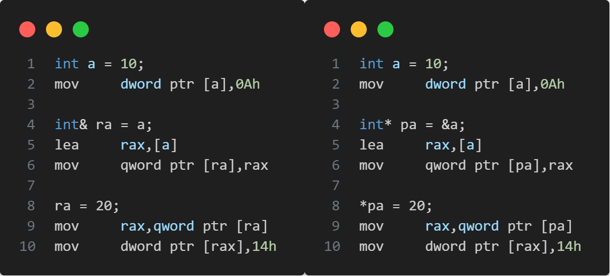

# Lesson01--C++入门

## 1. 命名空间

在C/C++中,变量,函数和类都是大量存在的,这些变量,函数和类的名称都存在于全局作用域中,可能会导致很多冲突.使用命名空间的目的是 **对标识符的名称进行本地化** ,以 **避免命名冲突或名字污染** , `namespace` 关键字的出现就是针对这种问题的.

### 1.1 定义命名空间

定义命名空间需要使用 `namespace` 关键字,后面跟 **命名空间的名字** ,然后接一对 `{}` 即可, `{}` 中即为命名空间的成员.

```C++{.line-numbers}
//普通的命名空间
namespace N1//N1为命名空间的名称
{
    //命名空间中,既可以定义变量,也可以定义函数
    int x;
    int ADD(int left,int right)
    {
        return left + right;
    }
}

//命名空间可以嵌套
namespace N2
{
    int y;
    namespace N3
    {
        int z;
    }
}
```

* 命名空间中可以定义变量,也可以定义函数.
* 命名空间可以嵌套.
* 同一个工程中允许存在多个相同名称的命名空间,编译器最后会合成为同一个命名空间.

### 1.2 命名空间的使用

命名空间的使用有三种方式:

1. 加命名空间名称及作用域限定符
   ```C++{.line-numbers}
   N1::x = 10;
   N2::y = 20;
   N2::N3::z = 30;
   ```
2. 使用 `using` 关键字将命名空间中某个成员引入
   ```C++{.line-numbers}
   using N1::x,N1::ADD;
   using N2::y;
   using N2::N3::z;
   y = 10;
   z = 20;
   x = ADD(y,z);
   ```
3. 使用 `using namespace` 将命名空间引入
   ```C++{.line-numbers}
   using namespace N1;
   using namespace N2;
   x = ADD(10,20);
   N3::z = x;
   ```

## 2. C++输入和输出

```C++{.line-numbers}
#include<iostream>
//std是C++标准库的命名空间,C++将标准库的定义实现都放到这个命名空间中
using namespace std;
int main()
{
    cout << "Hello World!";
    cout << endl;
    cout << "This is C++!" << endl;

    int a;
    double b;
    char c;
    cin >> a;
    cin >> b >> c;
    cout << a << b << "   " << c << endl;
    return 0;
}
```

1. 使用 `cout` **标准输出对象** 和 `cin` **标准输入对象** 时,必须包含 `<iostream>` **头文件** ,以及使用 `std` **命名空间** .
2. `<<` 是流插入运算符, `>>` 是流提取运算符.表示信息的流动路径.
3. `cout` 和 `cin` 是全局流对象, 控制符 `endl` 是一个特殊的C++符号,表示:换行输出.在输出流中插入 `endl` 将使屏幕光标移到下一行开头. `endl` 也是在头文件 `<iostream>` 中定义的,且位于命名空间 `std` 中.

## 3. 缺省参数

### 3.1 缺省参数概念

缺省参数是 **声明或定义函数** 时, **为函数的参数指定一个缺省值** ,否则使用指定的实参.

```C++{.line-numbers}
void Func(int a = 0)
{
    cout << a << endl;
}
int main()
{
    Func();    //没有传参时,使用参数的缺省值
    Func(10);  //传参时,使用指定的实参
    return 0;
}
```

### 3.2 缺省参数的分类

1. 全缺省参数
   ```C++{.line-numbers}
   void Func(int a = 10,int b = 20,int c = 30)
   {
        cout << "a = " << a << endl;
        cout << "b = " << b << endl;
        cout << "c = " << c << endl;
   }
   ```
2. 半缺省参数
   ```C++{.line-numbers}
   void Func(int a,int b = 10,int c = 20)
   {
        cout << "a = " << a << endl;
        cout << "b = " << b << endl;
        cout << "c = " << c << endl;
   }
   ```
   1. 半缺省参数必须 **从右向左依次给出** ,不可间隔.
   2. 缺省参数不能在函数声明和定义中同时出现.
   3. 缺省值必须是常量或全局变量.
   4. C语言不支持.

## 4. 函数重载

### 4.1 函数重载概念

**函数重载:** 是函数的一种特殊情况,C++允许在同一作用域中声明几个功能类似的同名函数,这些同名函数的 **形参列表(参数个数 或 类型 或 类型顺序)不同** ,常用来处理实现功能类似数据类型不同的问题.

```C++{.line-numbers}
#include<iostream>
using namespace std;
//1.参数类型不同
int ADD(int left,int right)
{
    return left + right;
}
double ADD(double left,double right)
{
    return left + right;
}
//2.参数个数不同
int MAX(int x,int y)
{
    return x > y ? x : y;
}
int MAX(int x,int y,int z)
{
    return x > (y > z ? y : z) ? x : (y > z ? y : z);
}
//3.参数类型顺序不同
void FUNC(int a, char b)
{
    cout << "FUNC(int a,char b)" << endl;
}
void FUNC(char b,int a)
{
    cout << "FUNC(char b,int a)" << endl;
}
```

只是函数的返回值不同是不能构成函数重载,函数重载会根据函数参数的不同自动识别.

### 4.2 C++支持函数重载的原理--名字修饰(name Mangling)

在C/C++中,一个程序要运行起来,需要经历以下几个阶段:预处理,编译,汇编,连接.

1. 预处理->头文件展开,宏替换,条件编译,去注释
   a.i b.i
2. 编译->检查语法,生成汇编代码
   a.s b.s
3. 汇编->转成二进制的机器码
   a.o b.o  
4. 链接->将目标文件链接在一起

实际项目通常是由多个源文件构成的,当a.cpp中调用了b.cpp中定义的FUNC函数时,链接器看到了a.o调用FUNC函数,但是没有FUNC函数的地址,就会到b.o中寻找FUNC函数的地址,然后链接到一起.  
面对FUNC函数重载时,每个编译器会根据自己的函数名修饰规则在编译阶段修饰重载的FUNC函数名,参数列表不同,修饰出来的函数名就不同.这样在链接时,链接器就能找到所需要的重载的FUNC函数.

## 5. 引用

### 5.1 引用概念

C++新增了一种复合类型--引用变量.引用是已定义的变量的别名.编译器不会为引用变量开辟内存空间,它和它引用的变量共用一块内存空间.

**类型& 引用变量名(对象名) = 引用实体;**

```C++{.lin-numbers}
int a = 10;
int& ra = a;//定义引用类型变量
```

**注意:** 引用类型必须和引用实体是同种类型的.

### 5.2 引用特性

1. 引用变量在定义时必须初始化.
2. 引用变量一旦引用一个实体,再不能引用其它实体.
3. 一个变量可以有多个引用.

### 5.3 常引用

```C++{.line-numbers}
const int a = 10;
//int& ra = a;      //该语句编译时会出错,a为常量
const int& ra = a;
//int& b = 10;      //该语句编译时会出错,10为常量
const int& b = 10;
double c = 12.34;
//int& rc = c;      //该语句编译时会出错,类型不同
const int& rc = c;
```

### 5.4 引用使用场景

1. 做参数
   ```C++{.line-numbers}
   void Swap(int& left,int& right)
   {
    int temp = left;
    left = right;
    right = temp;
   }
   ```
2. 做返回值
   ```C++{.line-numbers}
   int& Count()
   {
    static int n = 0;
    ++n;
    return n;
   }
   ```
   注意:如果函数返回时,出了函数作用域,如果返回对象还在(没有还给系统),则可以使用引用返回.如果已经还给系统,则必须使用传值返回.

### 5.5 传值,传引用效率比较

以值作为参数或者返回值类型,在传参和返回期间,函数不会直接传递实参或者将变量本身直接返回,而是传递实参或者返回变量的一份临时拷贝,因此用值作为参数或者返回值类型,效率是非常低下的,尤其是当参数或者返回值类型非常大时,效率就更低.

#### 5.5.1 值和引用的作为参数类型的性能比较

```C++{.line-numbers}
#include<iostream>
#include<time.h>
using namespace std;
struct A{int a[10000];};
void TestFunc1(A a){}
void TestFunc2(A& a){}
void TestParameterByValueOrRef()
{
    A a;
    //以值作为函数参数
    size_t begin1 = clock();
    for(size_t i = 0;i < 10000;++i)
        TestFunc1(a);
    size_t end1 = clock();
    //以引用作为函数参数
    size_t begin2 = clock();
    for(size_t i = 0;i < 10000;++i)
        TestFunc2(a);
    size_t end2 = clock();
    //分别计算两个函数运行结束后的时间
    cout << "TestFunc1(A)-time:" << end1 - begin1 << endl;
    cout << "TestFunc2(A&)-time:" << end2 - begin2 << endl;
}
```

#### 5.5.2 值和引用的作为返回值类型的性能比较

```C++{.line-numbers}
#include<iostream>
#include<time.h>
using namespace std;
struct A{int a[10000];};
A a;
A TestFunc1(){return a;}
A& TestFunc2(){return a;}
void TestReturnByValueOrRef()
{
    //以值作为函数的返回值类型
    size_t begin1 = clock();
    for(size_t i = 0;i < 10000;++i)
        TestFunc1();
    size_t end1 = clock();
    //以引用作为函数的返回值类型
    size_t begin2 = clock();
    for(size_t i = 0;i < 1000;++i)
        TestFunc2();
    size_t end2 = clock();
    //分别计算两个函数运算结束后的时间
    cout << "TestFunc1(A)-time:" << end1 - begin1 << endl;
    cout << "TestFunc2(A&)-time:" << end2 - begin2 << endl;
}
```

### 5.6 引用和指针的区别

在 **语法概念** 上引用就是一个别名，没有独立空间，和其引用实体共用同一块空间.

```C++{.line-numbers}
int a = 10;
int& ra = a;
cout << "&a = " << &a << endl;
cout << "&ra = " << &ra << ednl;
```

在 **底层实现** 上实际是有空间的,因为引用是按照指针方式来实现的.



引用和指针的不同点：
1. 引用概念上定义一个变量的别名,指针存储一个变量地址.
2. 引用在定义时必须初始化,指针没有要求.
3. 引用在初始化时引用一个实体后,就不能再引用其它实体,而指针可以在任何时候指向任何一个同类型实体.
4. 没有NULL引用,但有NULL指针.
5. 在 `sizeof` 中含义不同:引用结果为引用类型的大小,但指针始终是地址空间所占字节个数.
6. 引用自加即引用的实体增加1,指针自加即指针向后偏移一个类型的大小.
7. 有多级指针,但是没有多级引用.
8. 访问实体方式不同,指针需要显式解引用,引用编译器自己处理.
9. 引用比指针使用起来相对更安全.

## 6. 内联函数

### 6.1 概念

以 `inline` 修饰的函数叫做内联函数,编译时C++编译器会在调用内联函数的地方展开, **没有函数调用建立栈帧的开销** ,内联函数提升程序的运行的效率.

查看方式:

1. 在release模式下,查看编译器生成的汇编代码中是否存在 `call FUNC` .
2. 在debug模式下,需要对编译器进行设置,否则不会展开(因为debug模式下,编译器默认不会对代码进行优化).

### 6.2 特性

1. `inline` 是一种 **以空间换时间** 的做法,如果编译器将函数当成内联函数处理,在编译阶段,会用函数体替换函数调用.
   缺陷:可能会使目标文件变大.  
   优势:少了调用开销,提高程序的运行效率.
2. **`inline` 对于编译器而言只是一个建议** ,不同编译器关于 `inline` 实现机制可能不同.
   一般建议:将函数规模较小,不是递归,且频繁调用的函数采用 `inline` 修饰,否则编译器会忽略 `inline` 特性.
   > **内联说明只是向编译器发出的一个请求,编译器可以选择忽略这个请求.** 
   > 一般来说内联机制用于优化规模较小,流程直接,频繁调用的函数.很多编译器都不支持内联递归函数,而且一个75行的函数也不大可能在调用点内联地展开.
3. `inline` 不建议声明和定义分离,分离会导致链接作物.因为内联函数被展开,就没有函数地址了,链接时就会找不到.

> **宏的优缺点**
> 优点:
> 1. 增强代码的复用性.
> 2. 提高性能.
> 缺点:
> 1. 不方便调试宏(因为预编译阶段进行了替换).
> 2. 导致代码可读性差,可维护性差,容易误用.
> 3. 没有类型安全的检查.
> 
> **C++有哪些技术替代宏**
> 1. 常量定义换用const enum
> 2. 短小函数定义换用内联函数

## 7. auto关键字

### 7.1 auto简介

在早期C/C++中, `auto` 的含义是: **使用 `auto` 修饰的变量,是具有自动存储器的局部变量** ,但很少有人使用.  
C++11中,标准委员会赋予了 `auto` 全新的含义: **`auto` 不再是一个存储类型指示符,而是作为一个新的类型指示符来指示编译器, `auto` 声明的变量必须由编译器在编译时期推导而得**.

```C++{.line-numbers}
int FUNC()
{
    return 10;
}
int a = 10;
auto b = a;
auto c = 'a';
auto d = FUNC();
```

**注意:**
使用 `auto` 定义变量时必须对其进行初始化,在编译阶段编译器需要根据初始化表达式来推到 `auto` 的实际类型.因此 `auto`并非是一种 **"类型"** 的声明,而是一个类型声明时的 **"占位符"** ,编译器在编译时会将 `auto` 替换为变量实际的类型.

### 7.2 auto的使用注意

1. `auto` 与指针或引用结合使用
   用 `auto` 声明指针类型时,用 `auto` 和 `auto*` 没有任何区别,但用 `auto` 声明引用类型时必须为 `auto&` .
   ```C++{.line-numbers}
   int x = 10;
   auto a = &x;
   auto* b = &x;
   auto& c = x;
   ```
2. 使用 `auto` 类型在同一行定义多个变量
   当在同一行声明多个变量时,这些变量必须是相同的类型,否则编译器将会报错,因为编译器实际只对第一个类型进行推导,然后用推导出来的类型定义其它变量.
3. `auto` 不能作为函数的参数
4. `auto` 不能直接用来声明数组
5. 为了避免与 *C++98* 中的 `auto` 发生混淆, *C++11* 只保留了 `auto` 作为类型指示符的用法
6. `auto` 在实际中最常见的优势用法就是 *C++11* 提供的新式for循环,还有 *lambda表达式* 等进行配合使用

## 8. 基于范围的for循环

### 8.1 范围for的用法

在C++98中使用for循环来遍历一个数组:

```C++{.line-numbers}
void TestFor()
{
    int array[] = {1,2,3,4,5};
    for(int i = 0;i < sizeof(array) / sizeof(array[0]);++i)
        cout << array[i];
}
```

对于一个有范围的集合而言,由程序员来说明循环的范围是多余的,且易出错.因此, *C++11* 中引入了基于范围的for循环.for循环后的括号由冒号":"分为两部分:第一部分是范围内用于迭代的变量,第二部分则表示被迭代的范围.

```C++{.line-numbers}
void TestFor()
{
    int array[] = {1,2,3,4,5};
    for(auto& e : array)
        cout << e;
}
```

与普通循环类似,可以用 `continue` 来结束本次循环,也可以用 `break` 来跳出整个循环.

### 8.2 范围for的使用条件

1. for循环迭代的范围必须是确定的
   对于数组而言,就是数组中第一个元素和最后一个元素的范围;对于类而言,应该提供begin和end的方法,begin和end就是for循环迭代的范围.
2. 迭代的对象要实现 `++` 和 `==` 的操作

## 9. 指针空值nullptr(C++11)

### 9.1 C++98中的指针空值

在良好的C/C++编程习惯中,声明一个变量时最好给该变量一个合适的初始值.如果没有一个合适的初始值,我们一般都是按照如下方式对其进行初始化:

```C++{.line-numbers}
void TestPtr()
{
    int* p1 = NULL;
    int* p2 = 0;
}
```

NULL实际是一个宏,,在头文件中可以看到如下代码:

```C++{.line-numbers}
#ifndef NULL
    #ifdef __cplusplus
        #define NULL 0
    #else
        #define NULL ((void *)0)
    #endif
#endif
```

可以看到,NULL可能被定义为字面常量 `0` ,或者被定义为无类型指针 `(void*)` 的常量.不论采用何种定义,在使用空值指针时,都不可避免的会遇到些麻烦:

```C++{.line-numbers}
void f(int)
{
    cout << "f(int)" << endl;
}
void f(int*)
{
    cout << "f(int*)" << endl;
}
int main()
{
    f(0);//f(int)
    f(NULL);//f(int)
    f((int*)NULL);//f(int*)
    f(nullptr);//f(int*)
    return 0;
}
```

在 *C++98* 中,字面常量0既可以是一个整型数字,也可以是无类型的指针常量,但是编译器默认情况下将其看成是一个整型常量,如果要将其按照指针方式来使用,必须对其强制转换为 `(void*)0` .

注意:
1. 在使用 `nullptr` 表示指针空值时,不需要包含头文件,因为 `nullptr` 是 *C++11* 作为新关键字引入的.
2. 在 *C++11* 中, `sizeof(nullptr)` 与 `sizeof((void*)0)` 所占的字节数相同.
3. 为了提高代码的健壮性,表示指针空值时,最好使用 `nullptr` .