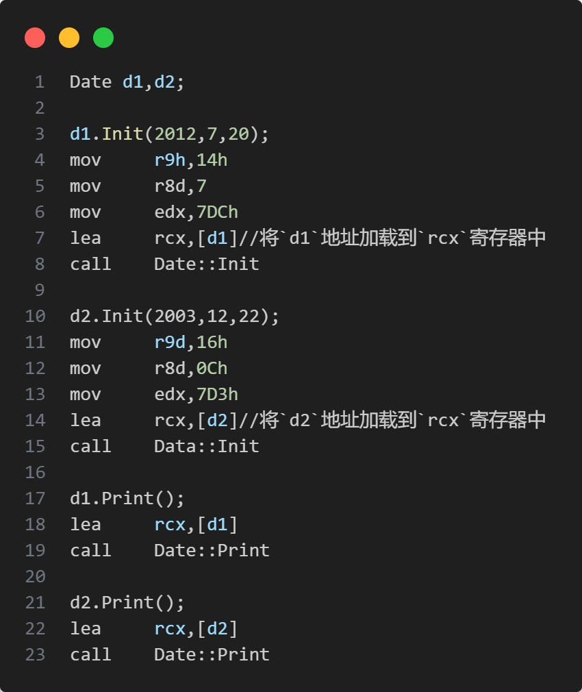

# Lesson02--类与对象(上)

## 1. 类

C语言中,结构体只能定义变量.  
在C++中,结构体内不仅可以定义变量,也可以定义函数.  
C++中更喜欢用 `class` 来定义结构体,也就是类.  

### 1.1 类的定义

```C++{.line-numbers}
class ClassName
{
    //类体:由成员函数和成员变量组成
};//注意分号
```

`class` 为定义类的关键字, `ClassName` 为类的名字, `{}` 中为类的主体,注意类定义结束时后面的分号.  
类中元素为类的成员:类中的 **数据** 为 **类的属性** 或者 **成员变量** ;类中的 **函数** 为 **类的方法** 或者 **成员函数** .

### 1.2 类的两种定义方式

1. 声明和定义全部放在类体中,需要注意:成员函数如果在类中定义,编译器可能会将其当成内联函数处理.
2. 声明放在 `.h` 文件中,类的定义放在 `.cpp` 文件中.

一般情况下，更期望采用第二种方式。

## 2. 类的访问限定符及封装

```C++{.line-numbers}
class Student
{
public:
    void ShowInfo()
    {
        cout << _name << endl;
        cout << _age << endl;
        cout << _stuid << endl;
    }
private:
    //一般情况下成员变量都是比较隐私的，都会定义成私有或者保护
    char _name[20];
    int _age;
    int _stuid;
};
```

### 2.1 访问限定符

C++实现封装的方式:用类将对象的属性与方法结合在一块,让对象更加完善,通过 **访问权限** 选择性地将接口提供给外部的用户使用.

**访问限定符**

* `public` (公有)
* `protected` (保护)
* `private` (私有)

1. `public` 修饰的成员在类外可以直接被访问.
2. `protected` 和 `private` 修饰的成员在类外不能直接被访问.
3. 访问权限作用域从从该访问限定符出现的位置开始直到下一个访问限定符出现时为止.
4. `class` 的默认访问权限为 `private` , `struct` 为 `public` (兼容C).

**注意:** 访问限定符只在编译时有用,当数据映射到内存后,没有任何访问限定符上的区别.

> **C++中 `struct` 和 `class` 的区别**
> 
> C++需要兼容C语言,所以C++中 `struct` 可以当成结构体去使用.另外,C++中 `struct` 还可以定义类.和 `class` 定义类是一样的,区别是 `struct` 的成员默认访问权限是 `public` , `class` 的成员默认访问方式是 `private` .

### 2.2 封装

> 面向对象的三大特性: **封装** , **继承** , **多态** .
> 在类和对象阶段,主要研究类的封装特性.
> 封装:将数据和操作数据的方法进行有机结合,隐藏对象的属性和实现细节,仅对外公开接口来和对象进行交互.
> 封装本质是一种管理,让用户更方便地使用类.

## 3. 类的作用域

**类定义了一个新的作用域** ,类的所用成员都在类的作用域中.在类体外定义成员,需要使用作用域限定符 `::` .作用域限定符指明成员属于哪个类.

```C++{.line-numbers}
class Person
{
public:
    void PrintPersonInfo();
private:
    char* _name;
    char* _gender;
    int _age;
};
void Person::PrintPersonInfo()
{
    cout << _name << " " << _gender << " " << _age << endl;
}
```

## 4. 类的实例化

用类类型创建对象的过程,称为类的实例化.类是对对象的的描述,定义出一个类并没有分配实际的内存空间来存储它;一个类可以实例化出多个对象;实例化出的对象占用实际的物理空间,存储成员变量.

```C++{.line-numbers}
class Person
{
public:
    void PrintPersonInfo()
    {
        cout << _name << " " << _gender << " " << _age << endl;
    }
private:
    char* _name;
    char* _gender;
    int _age;
};
int main()
{
Person p1;
p1._name = (char*)"Soyo";
p1._gender = (char*)"female";
p1._age = 18;
p1.PrintPersonInfo();
}
```

## 5. 类对象模型

### 5.1 类对象的存储

类对象中只存储成员变量, **不存储成员函数** .
一个类实例化出N个对象,每个对象的成员变量都可以存储不同的值,但是调用的函数却是同一个.如果每个对象都储存成员函数,则会浪费空间.
计算类的大小只考虑成员变量,并遵循 **内存对齐规则** .

### 5.2 结构体内存对齐规则

1. 第一个成员在与结构体偏移量为0的地址处.
2. 其他成员变量要对齐到 **对齐数** 的整数倍的地址处.
   **注意:**
   对齐数=编译器默认的一个对齐数与该成员大小的 **较小值**.
   VS中默认的对齐数为8.
3. 结构体总大小为最大对齐数(所有变量类型最大者与默认对齐参数取最小)的整数倍.
4. 如果嵌套了结构体的情况，嵌套的结构体对齐到自己的最大对齐数的整数倍处,结构体的整体大小就是所有最大对齐数(含嵌套结构体对齐数)的整数倍.

## 6. this指针

C++编译器给每个"非静态成员函数"增加了一个隐藏的指针参数，让该指针指向当前对象(函数运行时调用该函数的对象)，在函数体中所有成员变量的操作，都是通过该指针去访问。只不过所有的操作对用户时透明的，即用户不需要来传递，编译器自动完成。

### 6.1 this指针的引出

```C++{.line-numbers}
class Date
{
public:
    void Init(int year,int month,int day)
    {
        _year = year;
        _month = month;
        _day = day;
    }
    void Print()
    {
        cout << _year << "-" << _month << "-" << _day << endl;
    }
private:
    int _year;
    int _month;
    int _day;
};
int main()
{
    Date d1,d2;
    d1.Init(2012,7,20);
    d2.Init(2003,12,22);
    d1.Print();
    d2.Print();
    return 0;
}
```

`Data` 类中,有 `Init` 与 `Print` 两个成员函数,成员函数存储在程序代码段中,函数体中没有关于不同对象的区分,那么当 `d1` 调用 `Init` 或 `Print` 函数时,函数是如何确定要访问 `d1` 中的成员变量,而不是 `d2`中的成员变量?

C++中通过引入 `this` 指针来解决该问题:C++编译器给每个 **非静态的成员函数** 增加了一个隐藏的 `this` 指针参数,该指针指向当前对象(函数运行时调用该函数的对象),在函数体中所有的成员变量访问,都是通过该指针去访问.不需要用户来传递,编译器自动完成.

### 6.2 this指针的特性

1. `this` 指针的类型: `类型* const` ,即在成员函数中,不能给 `this` 指针赋值.
2. 只能在 **成员函数** 的内部使用.
3. `this` 指针本质上其实是一个成员函数的形参,是对象调用成员函数时,将对象地址作为实参传递给 `this` 形参.所以对象中不存储 `this` 指针.
4. `this` 指针是成员函数第一个隐含的形参,一般情况由编译器通过ecx寄存器自动传递,不需要用户传递.

```C++{.line-numbers}
#include<iostream>
using namespace std;
class A
{
public:
    void Input()
    {
        cin >> this->_a;
    }
    void Show()
    {
        cout << "Show()" << endl;
    }
private:
    int _a;
};
int main()
{
    A*p=nullptr;
    p->Show();
    //程序成功运行.成员函数Show()存储在公共代码区域,不需要到空指针p中寻找.
    //此处"->"并未执行解引用操作.
    p->Input();
    //程序编译通过,运行崩溃.成员函数掉用了成员变量,需要到空指针中寻找.
    //指针p作为参数传给成员函数.
    return 0;
}
```

this指针存在栈上,因为它是一个形参(VS下是在rcx寄存器(64位)或ecx寄存器(32位)里).

