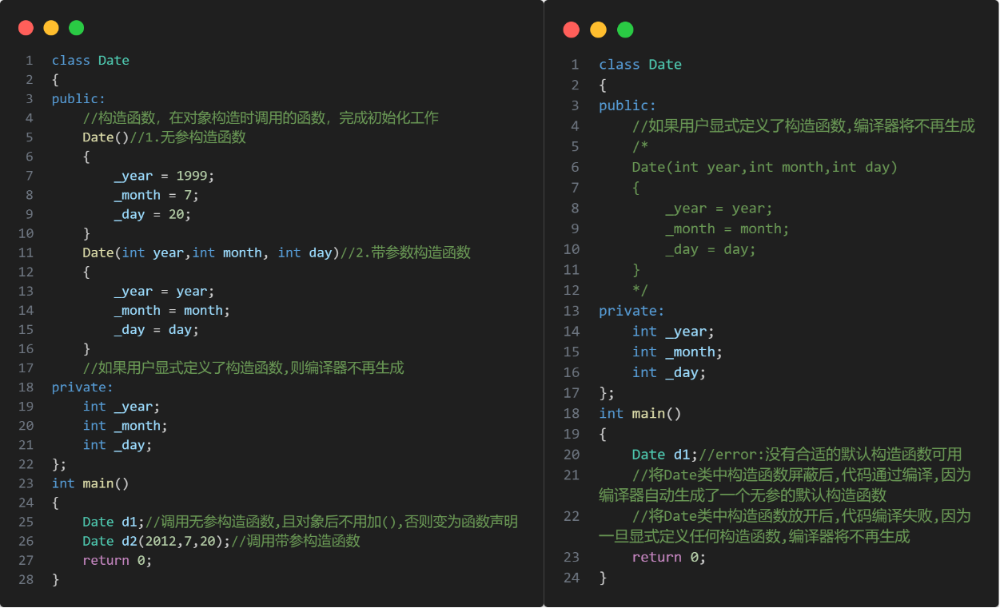

# Lesson02--类与对象(中)

如果一个类中什么成员都没有,称为空类.

```C++{.line-numbers}
class Date {};
```

但空类并不是什么都没有.  
任何一个类都会自动生成6个默认成员函数.  
默认成员函数:用户没有显示实现,编译器会自动生成的成员函数称为默认成员函数.

* 初始化和清理
  **构造函数** 主要完成初始化工作.
  **析构函数** 主要完成清理工作.
* 拷贝复制
  **拷贝构造** 是使用同类对象初始化创建对象.
  **赋值操作符重载** 主要是把一个对象赋值给另一个对象.
* 取地址重载
  **取地址操作符重载** 对普通对象取地址.
  **const修饰的取地址操作符重载** 对 `const` 修饰的对象取地址.

## 1. 构造函数

### 1.1 构造函数的概念

构造函数是特殊的成员函数,需要注意的是,构造函数虽然名称叫构造,但是构造函数的主要任务并不是开辟空间创建对象,而是 **初始化对象** .

**构造函数的函数名与类名相同** ,创建类类型对象时由编译器自动调用,以保证每个数据成员都有一个合适的初始值,并且 **在对象的生命周期内只调用一次** .

### 1.2 构造函数的特征
  
1. 函数名与类名相同.
2. 无返回值.
3. 对象实例化时编译器自动调用对应的构造函数.
4. 构造函数可以重载,缺省.
5. 如果类中没有显示定义构造函数,则C++编译器会自动生成一个无参的默认构造函数,一旦用户显式定义编译器将不再生成.
6. C++把类型分为 **内置类型(基本类型)** 和 **自定义类型** .内置类型就是语言提供的数据类型,自定义类型是使用 `class/struct/union` 等自己定义的类型,编译器生成默认的构造函数会对自定义类型成员调用它的默认成员函数. *C++11* 中针对内置类型成员不初始化的缺陷打了补丁,即:内置类型成员变量在类中声明时可以给默认值.
7. 无参构造函数和全缺省的构造函数都称为默认构造函数,并且默认构造函数只能有一个.无参构造函数,全缺省构造函数,编译器默认生成的构造函数,都可以认为是默认构造函数.



```C++{.line-numbers}
class Time
{
public:
    Time()
    {
        cout << "Time()" << endl;
        _hour = 0;
        _minute = 0;
        _second = 0;
        //C++11中针对内置类型成员不初始化的缺陷打了补丁,即:内置类型成员再类中声明时可以给默认值
    }
private:
    int _hour;
    int _month;
    int _second;
};
class Date
{
private:
    //基本类型(内置类型)
    int _year;
    int _month;
    int _day;
    //自定义类型
    Time t;
};
int main()
{
    Date d;
    return 0;
}
```

```C++{.line-numbers}
#include<iostream>
using namespace std;
class Time
{
public:
    Time()
    {
        _hour = 0;
        _minute = 0;
        _second = 0;
    }
    Time(int hour=0,int minute=0,int second=0)
    {
        _hour = hour;
        _minute = minute;
        _second = second;
    }
private:
    int _hour;
    int _minute;
    int _second;
};
int mian()
{
    Time t1;//错误
    //全缺省构造函数不能与无参构造函数或编译器默认生成的构造函数重载
    //否则无参实例化时，无法判断调用哪个构造函数
    return 0；
}
```

无参的构造函数和全缺省的构造函数都称为默认构造函数,并且默认构造函数只能有一个,特点是不用传参.

## 2. 析构函数

### 2.1 析构函数的概念

与构造函数功能相反,析构函数不是完成对对象本身的销毁,局部对象销毁工作是由编译器完成的.
对象在销毁时会自动调用析构函数,完成对象中一些资源的清理工作.

### 2.2 析构函数的特征

析构函数是特殊的成员函数.

1. 析构函数名是在类名前加上字符 `~` .
2. 无参数,无返回值类型.
3. 一个类有且只有一个析构函数,不能重载.若未显式定义,系统会自动生成默认的析构函数.
4. 对象生命周期结束时,C++编译系统自动调用析构函数。

```C++{.line-numbers}
#include<iostream>
using namespace std;
class A
{
public:
    A()
    {
        p = new int;
    }
    ~A()
    {
        delete p;
    }
private:
    int* p;
};
int main()
{
    A a1;
    A a2;
    //析构函数，对象生命周期结束，自动调用
    //完成对象里面的资源清理工作
    //不是完成a1、a2的销毁
    //析构函数在栈帧中，所以会先销毁a2，再销毁a1
    return 0;
}
```

## 3. 拷贝构造

### 3.1 拷贝构造的概念

1. 拷贝构造函数是构造函数的一个重载形式.
2. 拷贝构造函数的参数只有一个且必须是类类型对象的引用,使用传值方式编译器直接报错,因为会引发无穷递归.
   ```C++{.line-numbers}
   class Date
   {
    public:
        Date(int year = 1900,int month = 1,int day = 1)
        {
            _year = year;
            _month = month;
            _day = day;
        }
        Date(const Date d)//错误写法,编译报错,会引发无限递归调用
        {
            _year = d.year;
            _month = d.month;
            _day = d.day;
        }
        //调用拷贝构造函数时要先传参
        //d1->d传参又是一个拷贝构造
        //而拷贝构造又要传参
        //会无穷递归下去
        //在传参过程中,需要调用形参d1的拷贝构造,将对象d赋值给形参d1;而调用形参d1的拷贝构造函数时,又要调用形参d1的拷贝构造函数的形参d2的拷贝构造函数,将d赋值给d2;而调用形参d2的拷贝构造函数时,又要调用形参d2的拷贝构造函数的形参d3的拷贝构造函数,将d赋值给d3;......
        //因此,该参数必须是类类型的引用,以免引发无穷递归

        Date(const Date& d)//正确写法,使用引用可以避免在传参过程中拷贝构造
        //用const修饰可以避免反向拷贝错误
        {
            _year = d.year;
            _month = d.month;
            _day = d.day;
        }
    private:
        int _year;
        int _month;
        int _day;
   };
   int main()
   {
    Date d1(2023,3,28);
    Date d2(d1);
    Date d3 = d1;//这两种都是调用拷贝构造
    return 0;
   }
   ```
3. 若未显式定义,编译器会生成默认的拷贝构造函数.默认生成的拷贝构造函数对象按内存存储,按字节序完成拷贝,这种拷贝方式叫做浅拷贝,或者值拷贝.
   注意:在编译器生成的默认拷贝构造函数中,内置类型是按照字节方式直接拷贝的,而自定义类型是调用其拷贝构造函数完成拷贝的.
   ```C++{.line-numbers}
   class Date
   {
    public:
        Date(int year = 1900,int month = 1,int day = 1)
        {
            _year = year;
            _month = month;
            _day = day;
        }
    private:
        int _year;
        int _month;
        int _day;
   };
   int main()
   {
    Date d1;
    Date d2(d1);//Date类并没有显式定义拷贝构造函数,编译器会给Date类生成一个默认的拷贝构造.
    return 0;
   }
   ```
4. 编译器生成的默认拷贝构造函数已经可以完成字节序的值拷贝了,但类中若涉及资源申请时,则需要显式实现拷贝构造函数,这种拷贝方式叫深拷贝.
   ```C++{.line-numbers}
   typedef int DataType;
   class Stack
   {
    public:
        Stack(size_t capacity = 10)
        {
            _array = (DataType*)malloc(capacity*sizeof(DataType));
            if(nullptr == _array)
            {
                perror("malloc申请空间失败");
                return;
            }
            _size = 0;
            _capacity = capacity;
        }
        void push(const DataType& data)
        {
            _array[_size] = data;
            _size++;
        }
        ~Stack()
        {
            if(_array)
            {
                free(_array);
                _array = nullptr;
                _capacity = 0;
                _size = 0;
            }
        }
    private:
        DataType* _array;
        size_t _size;
        size_t _capacity;
   };
   int main()
   {
    Stack s1;
    s1.Push(1);
    s1.Push(2);
    s1.Push(3);
    s1.Push(4);
    Stack s2(s1);//浅拷贝
    //s1对象调用构造函数创建,在构造函数中,默认申请了10个元素的空间,然后里面存了4个元素:1,2,3,4
    //s2对象使用s1拷贝构造,而Stack类没有显式定义拷贝构造函数,则编译器会给Stack类生成一份默认的拷贝构造函数,默认拷贝构造函数是按照值拷贝的,即将s1中内容原封不动地拷贝到s2中.因此s1和s2指向了同一块内存空间
    //当程序退出时,s2和s1要销毁.s2先销毁,s2销毁时调用析构函数,已经将将该空间释放了,到s1销毁时,会将该空间再释放一次,一块内存空间多次释放,肯定会造成程序崩溃
    return 0;
   }
   ```
5. 拷贝构造函数的典型调用场景:
   1. 使用已存在对象创建新对象.
   2. 函数参数类型为类类型对象.
   3. 函数返回值类型为类类型对象.

## 4. 赋值运算符重载

### 4.1 运算符重载

C++为了增强代码的可读性引入了运算符重载,运算符重载是具有特殊函数名的函数,也具有其返回值类型,函数名字以及参数列表,其返回值类型与参数列表与普通的函数类似.  
函数名字:关键字 `operator` 后面接需要重载的运算符符号  
函数原型:返回值类型 `operator` 操作符(参数列表)

**注意:**

* 不能通过连接其它符号来创建新的操作符,比如 `operator@` .
* 重载操作符必须有一个类类型或者枚举类型的操作数.
* 用于内置类型的操作符,其含义不能改变,例如:内置的整型 `+` ,不能改变其含义.
* 作为类成员的重载函数时,其形参看起来比操作数数目少1,成员函数的操作符有一个默认的形参 `this` ,限定为第一个形参.
* `.*` , `::` , `sizeof` , `? : ` , `.` 注意以上5个运算符不能重载.

```C++{.line-numbers}
class Date
{
public:
    Date(int year,int month,int day)
    {
        _year = year;
        _month = month;
        _day = day;
    }
    bool operator==(const Date& d)//此时隐含了一个this指针参数
    //bool operator==(const Date& d1,const Date& d2)
    //编译器会显示此运算符函数的参数太多,因为编译器隐含了一个this指针参数
    {
        return _year == d._year && _month == d._month && _day == d._day;
    }
    //自定义类型不能直接使用运算符,需要实现运算符的重载
    //结构体外实现运算符重载不能调用private里的成员变量
};
/*
//这里运算符重载成全局,需要成员变量是公有的,其封装性低
//可以用友元来解决,或直接重载成成员函数
bool operator==(const Date& d1,const Date& d2)
{
    return _year == d._year && _month == d._month && _day == d._day;
}
*/
int main()
{
    Date d1(2003,12,22);
    Date d2(1999,7,20);
    cout << (d1 == d2) << endl;
    cout << (d1.operator == (d2)) << endl;
    return 0;
}
```

### 4.2 赋值运算符重载

#### 4.2.1 赋值运算符重载格式

* **参数类型:** `const T&` ,传递引用可以提高传参效率.
* **返回值类型:** `T&` ,返回引用可以提高返回的效率,有返回值目的是为了支持连续赋值.
* **检测是否给自己赋值** .
* **返回对象:** 返回 `*this` ,要符合连续赋值的含义.

```C++{.line-numbers}
class Date
{
public:
    Date(int year = 1900,int month = 1,int day = 1)
    {
        _year = year;
        _month = month;
        _day = day;
    }
    Date(const Date& d)
    {
        _year = d._year;
        _month = d._month;
        _day = d._day;
    }
    //日期赋值的重载
    Date& operator=(const Date& d)//传引用返回可以减少一次赋值
    {
        if (this != &d)//判断是否给自己赋值
        {
            _year = d._year;
            _month = d._month;
            _day = d._day;
        }
        return *this;
    }
    //d1=d2=d3
    //为实现连续赋值,d2=d3必须有返回值
};
```

#### 4.2.2 赋值运算符只能重载成类的成员函数不能重载成全局函数

```C++{.line-numbers}
class Date
{
public:
    Date(int year = 1900,int month = 1,int day = 1)
    {
        _year = year;
        _month = month;
        _day = day;
    }
    int _year;
    int _month;
    int _day;
};
//赋值运算符重载成全局函数,重载成全局函数时没有this指针,需要给两个参数
Date& operator=(Date& left,const Date& right)
{
    if(&left != &right)
    {
        left._year = right._year;
        left._month = right._month;
        left._day = right._day;
    }
    return left;
};
//编译失败:
//error:"operator="必须是非静态成员
```

赋值运算符如果不显示实现,编译器会生成一个默认的.此时用户在类外自己实现一个全局的赋值运算符重载,就和编译器在类中生成的默认赋值运算符重载冲突了,故赋值运算符重载只能是类的成员函数.

#### 4.2.3 编译器生成的默认赋值运算符重载

用户没有显式实现时,编译器会生成一个默认赋值运算符重载,以值的方式逐字节拷贝.内置类型成员变量是直接赋值的,而自定义类型成员变量需要调用对应类的赋值运算符重载完成赋值.

如果类中涉及到资源管理,则必须要自己实现.

### 4.3 前置++和后置++重载

```C++{.line-numbers}
class Date
{
public:
    Date(int year = 1900,int month = 1,int day = 1)
    {
        _year = year;
        _month = month;
        _day = day;
    }
    //前置++:返回+1之后的结果
    //注意:this指向的对象函数结束后不会销毁,故以引用方式返回提高效率
    Date& operator++()
    {
        _day += 1;
        return *this;
    }
    //后置++:
    //前置++和后置++都是一元运算符,为了让前置++与后置++能正确重载
    //C++规定:后置++重载时多增加一个int类型的参数,但调用函数时该参数不用传递,编译器自动传递
    //注意:后置++是先使用后+1,因此需要返回+1之前的旧值,故需在实现时需要先将this保存一份,然后给this+1
    Date& operator++(int)
    {
        Date temp(*this);
        _day += 1;
        return temp;
    }
private:
    int _year;
    int _month;
    int _day;
};
```

## 5. 取地址及const取地址操作符重载

### 5.1 const成员

#### 5.1.1 const修饰类的成员函数

将const修饰的类成员函数称之为const成员函数,const修饰类成员函数,实际修饰该成员函数隐含的this指针,表明在该函数中不能对类的任何成员进行修改.

```C++{.line-numbers}
class Date
{
public:
void Display()const;
//相当于void Display(const Date* this);
//但this无法显式传参,该写法不被允许
void f1()//void f1(Date* this)
{
    f2();//this->f2(const Date* this) this指针权限缩小,可行
}
void f2()const
{}
void f3()const//void f3(const Date* this)
{
    f4();//错误,this指针权限放大,不可行
}
void f4()
{}
};
```

```C++{.line-numbers}
const Date* p1;//const修饰p1指向的对象
Date const* p2;//const修饰p2指向的对象
Date* const p3;//const修饰p3指针本身
//const在*前修饰*p(指针指向对象)
//const在*后修饰p(指针本身)
```

1. const对象不能调用非const成员函数.
2. 非const对象能调用const成员函数.
3. const成员函数内不能调用其它非const成员函数.
4. 非const成员函数内能调用其它const成员函数.

### 5.2 取地址及const取地址操作符重载

这两个默认成员函数一般不用重新定义,编译器会默认生成.

```C++{.line-numbers}
class Date
{
public:
    Date* operator&()
    {
        return this;
    }
    const Date* operator&()const
    {
        return this;
    }
};
```

这两个运算符一般不需要重载,使用编译器生成的默认取地址即可.
const取地址操作符重载用于const修饰的对象.