# Lesson05--STL简介

## 1. 什么是STL

**STL(standard template libaray-标准模板库)** :是C++标准库的重要组成部分,不仅是一个可复用的组件库,而且是一个包罗数据结构与算法的软件框架.

## 2. STL的版本

* 原始版本
  Alexander Stepanov,Meng Lee在惠普实验室完成的原始版本,本着开源精神,他们声明允许任何人任意运用,拷贝,修改,传播,商业使用这些代码,无需付费.唯一的条件就是也需要向原始版本一样做开源使用.
  HP版本-所有STL实现版本的始祖.
* P.J.版本
  由P.J.Plauger开发,继承自HP版本,被Windows Visual C++采用,不能公开或修改,缺陷:可读性比较低,符号命名比较怪异.
* RW版本
  由Rouge Wage公司开发,继承自HP版本,被C++ Builder采用,不能公开或修改,可读性一般.
* SGI版本
  由Silicon Graphics Computer Systems,Inc公司开发,继承自HP版本.被GCC(Linux)采用,可移植性好,可公开,修改甚至贩卖,从命名风格和编程风格上看,阅读性非常高.

## 3. STL的六大组件

* 仿函数
* 算法
* 迭代器
* 空间配置器
* 容器
* 配接器

## 4. STL的缺陷

1. STL库的更新太慢.
2. STL现在都没有支持线程安全.并发环境下需要我们自己枷锁,且锁的粒度比较大.
3. STL极度的追求效率,导致内部比较复杂.比如类型萃取,迭代器萃取.
4. STL的使用会有代码膨胀问题,这是模板语法本身导致的.