# Lesson07--vector

## 1. vector的介绍及使用

### 1.1 vector的介绍

1. `vector` 是表示可变大小数组的序列容器.
2. 就像数组一样, `vector` 也采用连续存储空间来存储元素.也就是意味着可以采用下标对 `vector` 的元素进行访问,和数组一样高效.但是又不像数组,它的大小是可以动态改变的,而且它的大小会被容器自动处理.
3. 本质讲, `vector` 使用动态分配数组来存储它的元素.当新元素插入的时候,为了增加存储空间,这个数组需要被重新分配大小.其做法是分配一个新的数组,然后将全部元素移到这个数组.就时间而言,这是一个相对代价高的任务,因为每当一个新的元素加入到容器的时候, `vector` 并不会每次都重新分配大小.
4. `vector` 分配空间策略: `vector` 会分配一些额外的空间以适应可能的增长,因为存储空间比实际需要的存储空间更大.不同的库采用不同的策略权衡空间的使用和重新分配.但是无论如何,重新分配都应该是对数增长的间隔大小,以至于在末尾插入一个元素的时候是在常数时间的复杂度完成的.
5. 因此, `vector` 占用了更多的存储空间,为了获得管理存储空间的能力,并且以一种有效的方式动态增长.
6. 与其它动态序列容器相比(deques,lists and forward_lists), `vector` 在访问元素的时候更加高效,在末尾添加和删除元素相对高效.对于其它不在末尾的删除和插入操作,效率更低.比起 `lists` 和 `forward_lists` 统一的迭代器和引用更好.

### 1.2 vector的使用

#### 1.2.1 vector的定义

|(constructor)构造函数声明|接口声明|
|-|-|
|vector()(重点)|无参构造|
|vector(size_type n,const value_type& val=value_type())|构造并初始化n个val|
|vector(const vector& x)(重点)|拷贝构造|
|vector(InputIterator first,InputIterator last)|使用迭代器进行初始化构造|

```C++{.line-numbers}
//constructing vectors
#include<iostream>
#include<vector>
int main()
{
    //constructors used in the same order as described above;
    std::vector<int> first;//empty vector of ints
    std::vector<int> second(4,100);//four ints with value 100
    std::vector<int> third(second.begin(),second.end());//iterating through second
    std::vector<int> fourth(third);//a copy of third
    //the iterator constructor can also be used to construct from arrays;
    int myints[]={16,2,77,29};
    std::vector<int> fifth(myints,myints+sizeof(myints)/sizeof(int));
    std::cout<<"The contents of fifth are:";
    for(std::vector<int>::iterator it=fifth.begin();it!=fifth.end();++it)
    {
        std::cout<<' '<<*it;
    }
    std::cout<<'\n';
    std::vector<vector<int>> sixth;
    return 0;
}
```

> `int a[M][N]`
> `a[i][j] == *(*(a + i) + j)`
> `a[i][j] == *(*a + (i * N + j))`
> 二维数组名会转化为第一行 **一维数组的地址** ,而不是首元素地址.

#### 1.2.2 vector iterator的使用

|iterator的使用|接口说明|
|-|-|
|begin+end(重点)|获取第一个数据位置的iterator/const_iterator,获取最后一个数据的下一个位置的iterator/const_iterator|
|rbegin+rend|获取最后一个数据位置的reverse_iterator,获取第一个数据前一个位置的reverse_iterator|

```C++{.line-numbers}
#include<iostream>
#include<vector>
using namespace std;
int main()
{   vector<int> s;//无参构造
    vector<int> s1(4,100);//构造并初始化4个100
    //vector<int> s2(s1.begin(),s1.end());//使用迭代器进行初始化构造
    //vector<int> s3(s1);//拷贝构造
    //cinst对象使用const迭代器进行遍历打印
    s1.push_back(1);
    s1.push_back(2);
    s1.push_back(3);
    s1.push_back(4);
    //使用迭代器进行遍历打印
    vector<int>::iterator it=s1.begin();//普通正向迭代器,可读可写
    while(it!=s1.end())
    {
        cout<<*it<<" ";
        ++it;
    }
    cout<<endl;
    vector<int>::const_iterator cit=s1.begin();//const正向迭代器,只读
    while(cit!=s1.end())
    {
        //*cit=1;错误
        cout<<*cit<<" ";
        ++cit;
    }
    //反向迭代器进行遍历打印
    vector<int>::reverse_iterator rit=s1.begin();//reverse逆置
    while(rit!=s1.rend())
    {
        cout<<*rit<<" ";
        ++rit;
    }
    cout<<endl;
    //范围for进行遍历打印->被编译器替换成迭代器方式遍历
    for(auto e:v)
    {
        cout<<e<<" ";
    }
    cout<<endl;
    return 0;
}
```

#### 1.2.3 vector空间增长问题

|容量空间|接口说明|
|-|-|
|size|获取数据个数|
|capacity|获取容量大小|
|empty|判断是否为空|
|resize(重点)|改变vector的size|
|reserve(重点)|改变vector放入capacity|

* capacity的代码在 *vs* 和 *g++* 下分别运行会发现, *vs* 下 `capacity` 是按1.5倍增长的, *g++* 是按2倍增长的.这个问题经常会考察,不要固化地认为,顺序表增容都是2倍,具体增长多少是根据具体的需求定义的. *vs* 是PJ版本 *STL* , *g++* 是SGI版本 *STL* .
* `reserve` 只负责开辟空间,如果确定知道需要用多少空间, `reserve` 可以缓解 `vector` 增容的代价缺陷问题.
* `resize` 在开辟空间的同时还会进行初始化,影响 `size` .

```C++{.line-numbers}
//vector::capacity
#include<iostream>
#include<vector>
int main()
{
    size_t sz;
    std::vector<int> foo;
    sz=foo.capacity();
    std::cout<<"making foo grow:\n";
    for(int i=0;i<100;++i)
    {
        foo.push_back(i);
        if(sz!=foo.capacity())
        {
            sz=foo.capacity();
            std::cout<<"capacity changed:"<<sz<<'\n';
        }
    }
}
```

> vs运行结果:  
> making foo grow:  
> capacity changed:1  
> capacity changed:2  
> capacity changed:3  
> capacity changed:4  
> capacity changed:6  
> capacity changed:9  
> capacity changed:13  
> capacity changed:19  
> capacity changed:28  
> capacity changed:42  
> capacity changed:63  
> capacity changed:94  
> capacity changed:141  
>  
> g++运行结果:  
> making foo grow:  
> capacity changed:1  
> capacity changed:2  
> capacity changed:4  
> capacity changed:8  
> capacity changed:16  
> capacity changed:32  
> capacity changed:64  
> capacity changed:128  

增容相同空间,vs增容次数更多,效率更低,空间浪费小,g++增容次数更少,效率更高,空间浪费大.

```C++{.line-numbers}
#include<iostream>
#include<vector>
#include<algorithm>
using namespace std;
int main()
{
    vector<int> s;
    s.reserve(10);//把s的空间扩至10
    s.resize(10);//把s的有效位扩至10,空位用0代替,若空间不够,会先自动扩容
    s.resize(20,5)//把s的有效位扩至20,空位用5代替
    //at()函数
    vector<int> v;
    v.push_back(1);
    v.push_back(2);
    v.push_back(3);
    v.push_back(4);
    v[4]=5;//错误,程序中断运行
    v.at(4)=5;//错误,at函数会检测是否访问越界
    //at函数与[]的区别是,at函数会检测访问是否越界
    //[]效率更高
    v.insert(v.begin(),0);
    v.erase(v.begin());
    //find函数
    //find函数存在于算法中,其头文件为algorithm
    //使用find函数查找3所在位置的iterator
    vector<int>::iterator pos1=find(v.begin(),v.end(),3);
    //在pos位置之前插入44
    v.insert(pos,44);
    //找到3的位置,删除之前插入的44
    vector<int>::iterator pos2=find(v.begin(),v.end(),3);
    if(pos2!=v.end())//若未找到,会返回end()
    {
        v.erase(pos2-1);
    }
    return 0;
}
```

#### 1.2.4 vector迭代器失效问题

```C++{.line-numbers}
#include<iostream>
#include<vector>
using namespace std;
int main()
{
    vector<int> v;
    v.push_back(1);
    v.push_back(2);
    v.push_back(3);
    v.push_back(4);
    //使用find查找3所在位置的iterator
    vector<int>::iterator pos=find(v.begin(),v.end(),3);
    //在pos位置之前插入44
    v.insert(pos,44);
    //删除插入的44
    v.erase(pos-1);//错误
}
```

**说明**

v.insert(pos,44);在插入时会因为空间不够而增容,增容之后pos会失效,之后的v.erase(pos-1);操作会出错,程序崩溃.

迭代器的主要作用就是让算法能够不用关心底层数据结构,其底层实际是一个指针,或者对指针进行了封装.

比如:vector的迭代器就是原生态指针T.因此迭代器失效,实际就是迭代器底层对应指针所指向的空间被销毁了,而使用一块已经被释放的空间,造成的后果是程序崩溃.

**对于vector可能会导致其迭代器失效的操作有**

会引起底层空间改变的操作都有可能使迭代器失效,比如:resize,reserve,insert,assign,push_back等.

```C++{.line-numbers}
#include<iostream>
#include<vector>
using namespace std;
int main()
{
    vector<int> v{1,2,3,4,5,6};
    auto it=v.begin();
    //将有效元素个数增加到100个,多出的位置使用8填充,操作期间底层会扩容
    //v.resize(100,8);
    //reserve的作用是改变容量大小但不改变有效元素个数,操作期间可能会引起底层容量改变
    //v.reserve(100);
    //插入元素期间,可能会引起扩容,而导致原空间被释放
    //v.insert(v.begin(),0);
    //v.push_back(8);
    //给vector重新赋值,可能会引起底层容量改变
    v.assign(100,8);
    while(it!=v.end())
    {
        cout<<*it<<" ";
        ++it;
    }
    cout<<endl;
    return 0;
}
```

**说明**

以上操作都有可能会导致vector扩容,也就是说vector旧空间被释放掉,而在打印时,it还使用释放之前的旧空间,在对it迭代器操作时,实际操作的是一块已经被释放的空间,而引起代码运行时的崩溃.

解决方法:在以上操作完成之后,如果想继续通过迭代器操作vector中的元素,只需给it重新赋值即可.

```C++{.line-numbers}
#include<iostream>
#include<vector>
using namespace std;
int main()
{
    int a[]={1,2,3,4};
    vector<int> v(a,a+sizeof(a)/sizeof(int));
    //使用find查找3所在位置的iterator
    vector<int>::iterator pos=find(v.begin(),v.end(),3);
    //删除pos位置的数据,导致pos迭代器失效
    v.erase(pos);
    cout<<*pos<<endl;//此处会导致非法访问
    return 0;
}
```

erase删除pos位置元素后,pos位置之后的元素会往前推移,没有导致底层空间的改变,理论上讲迭代器不应该会失效,但是,如果pos刚好是最后一个元素,删完之后pos刚好是end的位置,而end位置是没有元素的,那么pos就失效了.因此删除vector中任意位置上的元素时,vs就认为该位置迭代器失效了.

> 删除vector中所有的偶数  
> 
> ```C++{.line-numbers}
> #include<iostream>
> #include<vector>
> using namespace std;
> int main()
> {
>     vector<int> v{1,2,3,4};
>     auto it=v.begin();
>     while(it!=v.end())
>     {
>         if(*it%2==0)
>             it=v.erase(it);
>         else
>             ++it;
>     }        
>     return 0;     
> }
> ```
>
> 删除it之后,it就失效了.
> vs下会编译器会进行检查.
> gcc下没有严格的检查,可能会报错,可能会正常运行,也可能有个别偶数没被删除.
> 总结:不管哪个平台下,erase(it)后,it就失效了,只是导致的结果不一样.

## 2. vector深度剖析及模拟实现




### 2.1 std::vector的核心框架接口的模拟实现

这里的模拟实现不是把源码中的内容都搬下来,做个一模一样的东西,也不是造一个更好的轮子.模拟实现的目的是为了学习源码中的一些细节及核心框架.

```C++{.line-numbers}
namespace MyVector
{
    template<class T>
    class vector
    {
    public:
        //默认成员函数
        //构造函数
        vector()
        :_start(nullptr)
        ,_finish(nullptr)
        ,_end_Of_Storage(nullptr)
        {}
        //若使用iterator做迭代器,会导致初始化的迭代器区间[first,last)只能是vector的迭代器,迭代器区间[first,last)可以是任意容器的迭代器,还可以是函数模板
        template<class InputIterator>
        vector(InputIterator first,InputIterator last)
        :_start(nullptr)
        ,_finish(nullptr)
        ,_end_Of_Storage(nullptr)
        {
            while(first!=last)
            {
                push_back(*first);
                ++first;
            }
        }
        vector(size_t n,const T& value=T())//T类的匿名对象作为缺省值,T会调用自己的默认构造初始化
        :_start(nullptr)
        ,_finish(nullptr)
        ,_end_Of_Storage(nullptr)
        {
            reserve(v.capacity());//不初始化,reserve会崩溃
            for(const auto& e:v)
            {
                push_back(e);//拷贝数值
            }
        }
        //现代写法,实现拷贝构造函数
        vector(const vector<T>& v)
        :_start(nullptr)
        ,_finish(nullptr)
        ,_end_Of_Storage(nullptr)
        {
            vector<T>tmp(v.begin(),v.end())
            swap(tmp);
        }
        void swap(vector<T>& v)
        {
            std::swap(_start,v._start);
            std::swap(_finish,v._finish)
            std::swap(_end_Of_Storage,v._end_Of_Storage)
        }
        //赋值重载函数
        vector<T>& operator=(const vector<T> v)
        {
            swap(v);
            return *this;
        }
        //析构函数
        ~vector()
        {
            if(_start)
            {
                delete[] _start;
                _start=_finish=_end_Of_Storage=nullptr;
            }
        }
        //迭代器及访问遍历操作
        //Vector的迭代器是一个原生指针
        typedef T* iterator;
        typedef const T* const_iterator;
        iterator begin()
        {
            return _start;
        }
        iterator end()
        {
            return _finish;
        }
        //const对象调用const迭代器,只读
        const_iterator begin()const
        {
            return _start;
        }
        const_iterator end()const
        {
            return _finish;
        }
        T& operator[](size_t pos)
        {
            assert(pos<size());
            return _start[pos];
        }
        const T& operator[](size_t pos)const
        {
            assert(pos<size());
            return _start[pos];
        }
        //vector类的容量操作
        size_t size()const
        {
            return _finish-_start;
        }
        size_t capacity()const
        {
            return _end_Of_Storage-_start;
        }
        bool empty()const
        {
            return _start==_finish;
        }
        void resize(size_t n,const T& value=T())//T类的匿名对象作为缺省值,T会调用自己的默认构造初始化
        {
            //1.如果n小于当前size,则数据个数缩小为n
            if(n<=size())
            {
                _finish=_start+n;
                return;
            }
            //2.空间不够则扩容
            else
            {
                if(n>capacity())
                {
                    reserve(n);
                }
                //3.将size扩大到n
                while(_finish<_start+n)
                {
                    *_finish=value;
                    ++_finish;
                }
            }
        }
        void reserve(size_t n)
        {
            if(n>capacity())
            {
                size_t oldSize=size();
                //1.开辟新空间
                T* tmp=new T[n];
                //2.拷贝元素
                //memcpy(tmp,_start,sizeof(T)*size);
                //不可以用memcpy,如果T是内置类型或浅拷贝类型,在它们增容或者拷贝构造中,用memcpy是没有问题的(浅拷贝)
                //但是T是需要深拷贝的自定义类型,比如string类,千万不能使用memcpy进行对象间的拷贝,因为memcpy是浅拷贝,可能会引起内存泄漏甚至程序崩溃
                //在vs中,string的结构跟g++不同,在T(自定义类型)对象加了一个buf[16]的数组存储数据,如果数据小于16可能不会报错,实际还是有问题.
                if(_start)
                {
                    for(size_t i=0;i<oldSize;++i)
                    {
                        tmp[i]=_start[i];//调用T(自定义类型)::operator=,赋值重载函数本来就是深拷贝
                    }
                    //3.释放旧空间
                    delete[] _start;
                }
                _start=tmp;
                _finish=_start+oldSize;
                _end_Of_Storage=_start+n;
            }
        }
        //vector类的修改操作
        void push_back(const T& x)
        {
            if(_finish==_end_Of_Storage)
            {
                size_t newCapacity=(0==capacity())?1:capacity()*2;
                reserve(newCapacity);
            }
            *_finish=x;
            ++_finish;
            //insert(end(),x);
        }
        void pop_back()
        {
            assert(!empty());
            --_finish;
            //erase(end()-1);
        }
        //返回值指向新插入这个元素的位置
        //有返回值的函数,不一定要定义变量来接收
        iterator insert(iterator pos,const T& x)
        {
            assert(pos<=_finish);
            //空间不够先进行增容
            if(_finish==_end_Of_Storage)
            {
                size_t len=pos-_start;//计算pos相对_start是第几个位置
                size_t newCapacity=(0==capacity())?1:capacity()*2;
                reserve(newCapacity);
                //如果发生增容,更新pos,解决增容后pos失效的问题
                pos=_start+len;
            }
            iterator end=_finish-1;
            while(end>=pos)
            {
                *(end+1)=*end;
                --end;
            }
            *pos=x;
            ++_finish;
            return pos;
        }
        //方便解决:一边遍历一遍删除的迭代器失效问题
        iterator erase(iterator pos)
        {
            //挪动数据进行删除
            iterator it=pos+1;
            while(it!=_finish)
            {
                *(it-1)=*it;
                ++it;
            }
            --_finish;
            return pos;//返回删除数据的下一个位置
        }
        T& front()
        {
            return *_start;
        }
        const T& front()const
        {
            return *_start;
        }
        T& back()
        {
            return *(_finish-1);
        }
        const T& back()const
        {
            return *(_finish-1);
        }
    private:
        iterator _start;//指向数据块的开始
        iterator _finish；//指向有效数据的尾
        iterator _end_Of_Storage;//指向存储容量的尾
    };
}
```

### 2.2 使用memcpy拷贝问题

在模拟实现的vector时,还有一个深层次的浅拷贝问题:如果是int类型是不会出现问题的,问题出现在string上.

> 假设模拟实现的vector中的reserve接口中,使用memcpy进行拷贝,以下代码会发生什么问题？

> ```C++{.line-numbers}
> int mian()
> {
>     MyVector::vector<string> v;
>     v.push_back("1111");
>     v.push_back("2222");
>     v.push_back("3333");
>     v.push_back("4444");
>     v.push_back("5555");
>     return 0;
> }

**问题分析**

1. memcpy是内存的二进制格式拷贝,将一段内存空间中内容原封不动的拷贝到另外一段内存空间中.
2. 如果拷贝的是自定义类型的元素,memcpy即高效又不会出错,但如果拷贝的是自定义类型的元素,并且自定义类型元素中涉及到资源管理时,就会出错,因为memcpy的拷贝实际是浅拷贝.

**结论**

如果对象中涉及到资源管理时,不能使用memcpy进行对象之间的拷贝,因为memcpy是浅拷贝,否则可能会引起内存泄漏甚至程序崩溃.


严格来讲,这里叫对象数组,因为每个位置存储的是一个string对象,它真正的数据是_str所指向的空间.
当第5次push_back时需要调用reserve增容,开好空间后,memcpy将_start拷贝至tmp,_str拷贝_str,_size拷贝_size,_capacity拷贝_capacity都没有问题,关键问题是浅拷贝—,它把_start里_str所指向的空间也拷贝了,随后delete[] _start,因为数组是时string类对象,它会去调用string的析构函数将堆上的空间给释放掉,然后再把_start指向的空间给释放掉,然后_start指向tmp空间,并重新定位_finish,_endofstorage,然后再插入对象.但是tmp里每个string所指向的堆空间已经被释放了,也就是说_str所指向的空间是一块野指针空间,而当程序的生命周期结束,vector调用析构函数会再次对这块野指针空间释放.