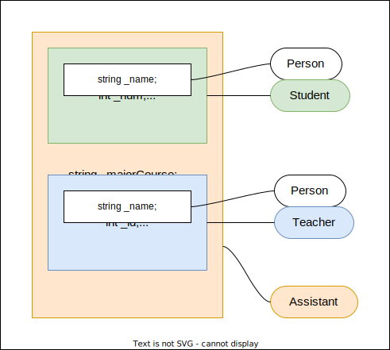

# Lesson11--继承

## 1. 继承的概念及定义

### 1.1 继承的概念

继承机制是面向对象程序设计使代码可以复用的最重要的手段,它允许程序员在保持原有类特性的基础上进行扩展,增加功能,这样产生的新类称为派生类.继承呈现了面向对象程序设计的层次结构,体现了由简单到复杂的认知过程.以前的复用都是函数复用,继承是类设计层次的复用.

```C++{.line-numbers}
class Person
{
public:
    void Print()
    {
        cout << "name:" << _name << endl;
        cout << "age:" << _age << endl;
    }
protected:
    string _name = "peter";//姓名
    int _age = 18;//年龄
};
//继承父类Person的成员(成员函数+成员变量)都会变成子类的一部分.这里体现出了Student和Teacher复用了Person的成员.
class Student : public Person
{
protected:
    int _stuid;//工号
};
class Teacher : public Person
{
protected:
    int _jobid;//工号
};
```

### 1.2 继承的定义

#### 1.2.1 定义格式

`Person` 是父类,也称作基类. `Student` 是子类,也称作派生类.


#### 1.2.2 继承关系和访问限定符


#### 1.2.3 继承基类成员访问方式的变化

| 类成员/继承方式     | public继承            | protected继承         | private继承         |
| ------------------- | --------------------- | --------------------- | ------------------- |
| 基类的public成员    | 派生类的public成员    | 派生类的protected成员 | 派生类的private成员 |
| 基类的protected成员 | 派生类的protected成员 | 派生类的protected成员 | 派生类的private成员 |
| 基类的private成员   | 在派生类中不可见      | 在派生类中不可见      | 在派生类中不可见    |

**总结** :
1. 基类 `private` 成员在派生类中无论以什么方式继承都是不可见的.这里的不可见是指基类的私有成员还是被继承到了派生对象中,但是语法上限制派生类对象不管在类里面还是类外面都不能去访问它.
2. 基类 `private` 成员在派生类中是不能被访问,如果基类成员不想在类外直接被访问,但需要在派生类中能访问,就定义为 `protected` .可以看出保护成员限定符是因继承才出现的.
3. 基类的私有成员在子类中都是不可见的.基类的其它成员在子类的访问方式为成员在基类的访问限定符与继承方式中访问权限最小的访问方式, $public>protected>private$ .
4. 使用关键字 `class` 时默认的继承方式是 `private` ,使用 `struct` 时默认的继承方式是 `public` ,最好显式地写出继承方式.
5. 在实际运用中一般使用都是 `public` 继承,几乎很少使用 `protected/private` 继承,也不提倡使用 `protected/private` 继承,因为 `protected/private` 继承下来的成员都只能在派生类的类里使用,实际中扩展维护性不强.

## 2. 基类和派生类对象赋值转换

* 派生类对象可以赋值给基类的对象/基类的指针/基类的引用.这里有个形象的说法叫切片或者切割.寓意把派生类中父类哪部分切割出来赋值过去.
* 基类对象不能赋值给派生类对象.
* 基类的指针可以通过强制类型转换赋值给派生类的指针.但是必须是基类的指针是指向派生类对象时才是安全的.这里基类如果是多态类型,可以使用RTTI(Run-Time Type Information)的dynamic cast来进行识别后进行安全转换. 


```C++{.line-numbers}
class Person
{
protected:
    string _name;
    string _sex;
    int _age;
};
class Student:public Person
{
public:
    int _No;
};
void Test()
{
    Student sobj;
    //父类和子类赋值兼容原则
    //1.派生类对象可以赋值给基类对象/指针/引用
    Person pobj = sobj;
    Person* pp = &sobj;
    Person& rp = sobj;
    //2.基类对象不能赋值给派生类对象
    sobj = pobj;//error
    //3.基类的指针可以通过强制类型转换赋值给派生类的指针
    pp = &sobj;//基类指针指向派生类地址
    Student* ps1 = (Student*)pp;//这种情况转换时是可以的
    ps1->_No = 10;

    pp = &pobj;//基类指针指向基类地址
    Student* ps2 = (Student*)pp;//这种情况转换虽然可以,但是会存在越界访问的问题
    ps2->_No = 10;
}
```

## 3. 继承中的作用域

1. 在继承体系中基类和派生类都有独立的作用域.
2. 子类和父类中有同名成员,子类成员将屏蔽父类对同名成员的直接访问,这种情况叫隐藏,也叫重定义.(在子类成员函数中,可以使用 基类::基类成员 显示访问)
3. 需要注意的是如果是成员函数的隐藏,只需要函数名相同就构成隐藏.
4. 注意在实际的继承体系里面最好不要定义同名成员.

```C++{.line-numbers}
//Student的_num和Person的_num构成隐藏关系,可以看出这样代码虽然能运行,但是非常容易混淆
class Person
{
protected:
    string _name = "小李子";//姓名
    int _num = 111;//身份证号
};
class Student : public Person
{
public:
    void Print()
    {
        std::cout << "姓名:" << _name << std::endl;
        std::cout << "身份证号:" << Person::_num << std::endl;
        std::cout << "学号:" << _num << std::endl;
    }
protected:
    int _num = 999;//学号
};
```

## 4. 派生类的默认成员函数


1. 派生类的构造函数必须调用基类的构造函数初始化基类的那一部分成员.如果基类没有默认的构造函数,则必须在派生类构造函数的初始化列表阶段显示调用.
2. 派生类的拷贝构造函数必须调用基类的拷贝构造完成基类的拷贝初始化.
3. 派生类的 `operator=` 必须要调用基类的 `operator=` 完成基类的赋值.
4. 派生类的析构函数会在被调用完成后自动调用基类的析构函数清理基类成员.因为这样才能保证派生类对象先清理派生类成员再清理基类成员的顺序.
5. 派生类对象初始化先调用基类构造,再调用派生类构造.
6. 派生类对象析构清理先调用派生类析构,再调用基类析构.
7. 因为后续一些场景析构函数需要构成重写,重写的条件之一是函数名相同.那么编译器会对析构函数名进行特殊处理,处理成 `destructor()` ,所以父类析构函数不加 `virtual` 的情况下,子类析构函数和父类析构函数构成隐藏关系.

```C++{.line-numbers}
class Person
{
public:
    Person(const char* name = "Peter")
    :_name(name)
    {
        cout << "Person(const char*)" << endl;
    }
    Person(const Person& p)
    :_name(p._name)
    {
        cout << "Person(const Person&)" << endl;
    }
    Person& operator=(const Person& p)
    {
        cout << "Person& operator=(const Person&)" << endl;
        if(this != &p)
            _name = p._name;
        return *this;
    }
    ~Person()
    {
        cout << "~Person()" << endl;
    }
protected:
    string _name;
};
class Student : public Person
{
public:
    Student(const char* name,int num)
    :Person(name)
    ,_num(num)
    {
        cout << "Student(const char*,int)" << endl;
    }
    Student(const Student& s)
    :Person(s)
    ,_num(s._num)
    {
        cout << "Student(const Student&)" << endl;
    }
    Student& operator=(const Student& s)
    {
        cout << "Student& operator=(const Student&)" << endl;
        if(this != &s)
        {
            Person::operator=(s);
            _num = s._num;
        }
        return *this;
    }
    ~Student()
    {
        cout << "~Student()" << endl;
    }
protected:
    int _num;
};
int main()
{
    const char* c = "abc";
    Student S(c,1);
    return 0;
}
```

> Person(const char*)  
> Student(const char**,int)  
> ~Student()  
> ~Person()  

## 5. 继承与友元

**友元关系不能继承** ,也就是说基类友元不能访问子类私有和保护成员.

> 类的友元函数是定义在类外部,但有权访问类的所有私有 `private` 成员和保护 `protected` 成员.尽管友元函数的原型有在类的定义中出现过,但是友元函数并不是成员函数.  
> 友元可以是一个函数,该函数被称为友元函数;友元也可以是一个类,该类被称为友元类,在这种情况下,整个类及其所有成员都是友元.

```C++{.line-numbers}
class Person
{
public:
    friend void Display(const Person& p,const Student& s);
protected:
    string _name;
};
class Student : public Person
{
protected:
    int _stuNum;
};
void Display(const Person& p,const Student& s)
{
    cout << p._name << endl;
    cout << s._stuNum << endl;
}
void maain()
{
    Person p;
    Student s;
    Display(p,s);//error
}
```

## 6. 继承与静态成员

**基类定义了 `static` 静态成员,则整个继承体系里面只有一个这样的成员** .无论派生出多少个子类,都只有一个 `static` 成员实例.

```C++{.line-numbers}
class Person
{
public:
    static int _count;
    Person()
    {
        ++_count;
    }
protected:
    string _name;
};
int Person::_count = 0;
class Student:public Person
{
protected:
    int _stuNum;
};
class Graduate:public Student
{
protected:
    string _seminarCourse;
};
void TestPerson()
{
    Student s1;
    Student s2;
    Student s3;
    Graduate s4;
    cout << "人数:" << Person::_count << endl;
    Student::_count = 0;
    cout << "人数:" << Person::_couunt << endl;
}
```

## 7. 菱形继承及菱形虚拟继承

### 7.1 菱形继承

单继承:一个子类只有一个直接父类时称这个继承关系为单继承.



多继承:一个子类有两个或以上直接父类时称这个继承关系为多继承.


菱形继承:菱形继承是多继承的一种特殊情况.


菱形继承的问题:从下面的对象成员模型构造,可以看出菱形继承有数据冗余和二义性的问题.在 `Assistant` 的对象中 `Person` 成员会有两份.



```C++{.line-numbers}
class Person
{
public:
    string _name;
};
class Student : public Person
{
protected:
    int _num;
};
class Teacher : public Person
{
protected:
    int _id;
};
class Assistant : public Student,public Teacher
{
protected:
    string _majorCourse;
};
void Test()
{
    //这样会有二义性,无法明确访问的是哪一个
    Assistant a;
    a._name = "peter";
    //需要显示指定访问哪个父类的成员可以解决二义性问题,但是数据冗余问题无法解决
    a.Student::_name = "xxx";
    a.Teacher::_name = "yyy";
}
```

### 7.2 虚拟继承

虚拟继承可以解决菱形继承的二义性和数据冗余的问题.如上面的继承关系,在 `Student` 和 `Teacher` 继承 `Person` 时使用虚拟继承,即可解决问题.需要注意的是,虚拟继承不要在其它地方使用.

```C++{.line-numbers}
class Person
{
public:
    string _name;
};
class Student:virtual public Person//虚拟继承
{
protected:
    int _num;
};
class Teacher:virtual public Person//虚拟继承
{
protected:
    int _id;
};
class Assistant:public Student,public Teacher
{
protected:
    string _majorCourse;
};
void Test()
{
    //这样会有二义性,无法明确访问的是哪一个
    Assistant a;
    a._name = "peter";
    //需要显示指定访问哪个父类的成员可以解决二义性问题,但是数据冗余问题无法解决
    a.Student::_name = "xxx";
    a.Teacher::_name = "yyy";
}
```

### 7.3 虚拟继承解决数据冗余和二义性的原理


虚拟继承虽然解决了菱形继承产生的二义性和数据冗余问题,但是为了解决一个 `int` 数据的冗余却开辟了两个存放虚基表的空间,而且访问虚基类数据时,要通过虚基表进行间接访问,效率会比较低,带来性能上的损耗,所以非必要时尽量避免菱形继承.

## 8. 继承的总结和反思

1. 很多人说C++语法复杂,多继承就是一个体现.有了多继承,就存在菱形继承,有了菱形继承,就有菱形虚拟继承,底层实现很复杂.所以一般不建议设计多继承,更不要设计菱形继承.否则在复杂度及性能上都有问题.
2. 多继承可以认为是C++的缺陷之一,很多后来的面向对象语言都没有多继承,如Java.
3. 继承和组合
   
   * public继承是一种is-a的关系.也就是说每个派生类对象都是一个基类对象.
   * 组合是一种has-a的关系.假设B组合了A,每个B对象中都有一个A对象.
   * 优先使用对象组合,而不是类继承.
   * 继承允许根据类的实现来定义派生类的实现.这种通过生成派生类的复用通常被称为白箱复用(white-box reuse).术语"白箱"是相对可视性而言:在继承方式中,基类的内部细节对子类可见.继承一定程度破坏了基类的封装,基类的改变对派生类有很大的影响.派生类和基类间的依赖关系很强,耦合度高.
    * 对象组合是类继承之外的另一种复用选择.新的更复杂的功能可以通过组装或组合对象来获得.对象组合要求被组合的对象具有良好定义的接口.这种复用风格被称为黑箱复用(black-box reuse),因为对象的内部细节是不可见的.对象只以"黑箱"的形式出现.组合类之间没有很强的依赖关系,耦合度低.优先使用对象组合有助于你保持每个类被封装.
   * 实际尽量多用组合.组合的耦合度低,代码维护性好.有些关系只适合继承就用继承,另外要实现多态,也必须要继承.类之间的关系可以用继承,可以用组合就用组合.

```C++{.line-numbers}
//Car和BMW Car构成is-a的关系
class Car
{
protected:
    string _color = "白色";
    string _num = "下北泽114514";
};
class BWM : public Car
{
public:
    void Drive(){}
};
class Benz : public Car
{
public:
    void Drive(){}
};

//Tire和Car构成has-a的关系
class Tire
{
protected:
    string _brand = "Michelin";
    size_t _size = 17;
};
class Car
{
protected:
    string _color = "白色";
    string _num = "下北泽114514";
    Tire _t;
};
```