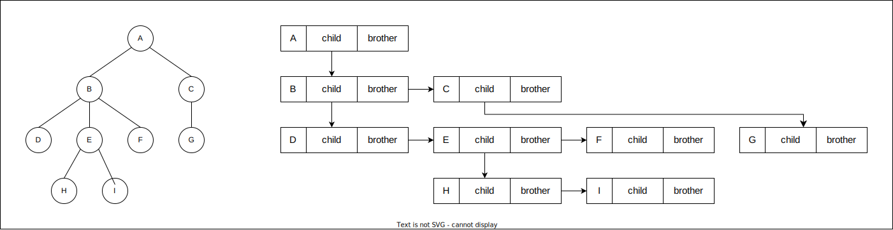
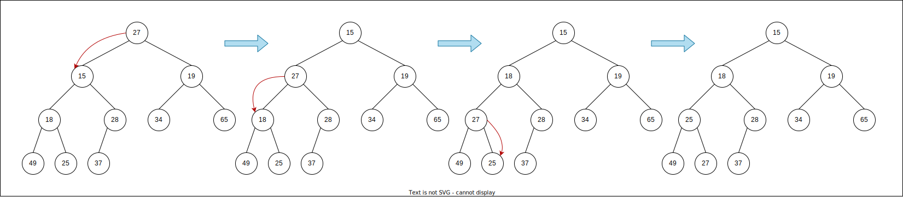
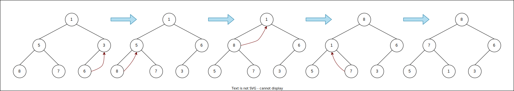

# Lesson13--二叉树

## 1. 树概念及结构

### 1.1 树的概念

树是一种非线性的数据结构,它是由 $n(n \ge 0)$ 个有限结点组成一个具有层次关系的集合.

* 有一个特殊的节点,称为根节点,根节点没有前驱节点.
* 除根节点外,其余节点被分成 $M>0$ 个互不相交的集合,其中每一个集合又是一棵结构与树类似的子树.每棵子树的根节点有且只有一个前驱,可以有0个或多个后继.
* 因此,树是递归定义的.

注意:树形结构中,子树之间不能有交集,否则就不是树形结构.

### 1.2 树的相关概念

* **节点的度:** 一个节点含有的子树的个数.
* **叶节点或终端节点:**度为0的节点称为叶节点.
* **非终端节点或分支节点:** 度不0的节点.
* **双亲节点或父节点:** 若一个节点含有子节点,则这个节点称为其子节点的父节点.
* **孩子节点或子节点:** 一个节点含有的子树的根节点称为该节点的子节点.
* **兄弟节点:** 具有相同父节点的节点称为兄弟节点.
* **树的度:** 一棵树中,最大的节点的度称为树的度.
* **节点的层次:** 从根开始定义起,根为第一层,根的子节点为第二层,以此类推.
* **树的高度或深度:** 树中节点的最大层次.
* **堂兄弟节点:** 双亲在同一层的节点互为堂兄弟.
* **节点的祖先:** 从根到该节点所经分支上的所有节点.
* **子孙:** 以某节点为根的子树中任意节点都称为该节点的子孙.
* **森林:** 有 $m(m>0)$ 棵互不相交的树的集合称为森林.

### 1.3 树的表示

树的结构相对线性表比较复杂,要存储表示比较麻烦,既要保存值域,也要保存节点和节点之间的关系,实际中树有很多种表示方式,如:双亲表示法,孩子表示法以及孩子兄弟表示法等.

最常用的孩子兄弟表示法:

```C{.line-numbers}
typedef int DataType;
struct Node
{
    struct Node* _firstChild;         //第一个孩子节点
    struct Node* _pNextBrother;       //指向其下一个兄弟节点
    DataType _data;                   //节点中的数据域
};
```



## 2. 二叉树概念及结构

### 2.1 概念

二叉树(Binary tree)是每个节点最多只有两个分支(即不存在分支度大于2的节点)的树结构.通常分支被称作"左子树"或"右子树".二叉树的分支具有左右次序,不能够随意颠倒.

### 2.2 特殊的二叉树

1. **满二叉树:** 一个二叉树,如果每一个层的节点数都达最大值,则这个二叉树就是满二叉树.也就是说,如果一个二叉树的层数为k,且节点总数是 $2^{k}-1$ ,则它就是满二叉树.
2. **完全二叉树:** 完全二叉树是效率很高的数据结构,完全二叉树是由满二叉树而引出来的.对于深度为k的,有n个节点的二叉树,当且仅当其每一个节点都与深度为k的满二叉树中编号从1至n的节点一一对应时称之为完全二叉树.要注意的是满二叉树是一种特殊的完全二叉树.

### 2.3 二叉树的性质

1. 若规定根节点层数为 $1$ ,则一棵非空二叉树的第i层上最多有 $2^{(i-1)}$ 个节点.
2. 若规定根节点的层数为 $1$ ,则深度为h的二叉树的最大节点数是 $2^h-1$ .
3. 对任何一棵二叉树,如果度为 $0$ 的叶节点个数为 $n_0$ ,度为 $2$ 的分支节点个数为 $n_2$ ,则有 $n_0=n_2+1$ .
4. 若规定根节点的层数为 $1$ ,具有 $n$ 个节点的满二叉树的深度, $h=\log_2(n+1)$ .
5. 对于具有 $n$ 个节点的完全二叉树,如果按照从上至下,从左至右的数组顺序对所有节点从 $0$ 开始编号,则对于序号为 $i$ 的节点有:
   1. 若 $i > 0$ ,i位置节点的双亲序号: $(i-1)/2$;
      若 $i = 0$ ,i位置节点为根结点.
   2. 若 $2i + 1 < n$ ,左孩子序号: $2i + 1$ , $2i + 1 \ge n$ 否则无左孩子.
   3. 若 $2i + 2 < n$ ,右孩子序号: $2i + 2$ , $2i + 2 \ge n$ 否则无右孩子.

### 2.4 二叉树的存储结构

二叉树一般可以使用两种结构存储,一种顺序结构,一种链式结构.
1. **顺序存储**
   顺序结构存储就是使用数组来存储,一般使用数组 **只适合表示完全二叉树** ,因为不是完全二叉树会有空间的浪费.而现实使用中只有堆才会使用数组来存储.
   二叉树顺序存储在物理上是一个数组,在逻辑上是一棵二叉树.
2. **链式存储**
   二叉树的链式存储结构是指,用链表来表示一棵二叉树,即用链来指示元素的逻辑关系.通常的方法是链表中每个节点由三个域组成,数据域和左右指针域,左右指针分别用来给出该节点左孩子和右孩子所在的链节点的存储地址.链式结构又分为二叉链和三叉链.
   ```C++{.line-numbers}
   typedef int BTDataType;
   //二叉链
   struct BinaryTreeNode
   {
      struct BinaryTreeNode* _pLeft;//指向当前节点左孩子
      struct BinaryTreeNode* _pRight;//指向当前节点右孩子
      BTDataType _data;//当前节点值域
   };
   //三叉链
   struct BinaryTreeNode
   {
      struct BinaryTreeNode* _pParent;//指向当前节点的双亲
      struct BinaryTreeNode* _pLeft;//指向当前节点左孩子
      struct BinaryTreeNode* _pRight;//指向当前节点右孩子
      BTDataType _data;//当前节点值域
   };
   ```

## 3. 二叉树的顺序结构及实现

### 3.1 二叉树的顺序结构

普通的二叉树不适合用数组来存储,因为会存在大量的空间浪费.而完全二叉树更适合使用顺序结构存储.现实中我们通常把堆(一种二叉树)使用顺序结构的数组来存储.(这里的堆和操作系统虚拟进程地址空间中的堆是两回事,一个是数据结构,一个是操作系统中管理内存的一块区域分段.)

### 3.2 堆的概念及结构

如果有一个关键码的集合 $K={k_0,k_1,k_2,...,k_{n-1}}$ ,把它的所有元素按完全二叉树的顺序存储方式存储在一个一维数组中,并满足: $K_i \le K_{2*i+1} 且 K_i \le K_{2*i+2} (K_i \ge K_{2*i+1} 且 K_i \ge K_{2*i+2}) i=0,1,2,...$ ,称为小堆(或大堆).将根节点最大的堆叫做大堆或大根堆,根节点最小的堆叫做小堆或小根堆.

堆的性质:
* 堆中某个节点的值总是不大于(或不小于)其父节点的值.
* 堆总是一棵完全二叉树.



### 3.3 堆的实现

#### 3.3.1 堆向下调整算法

从根节点开始向下调整算法可以把它调整成一个小堆,向下调整算法有一个前提: **左右子树必须是一个堆** ,才能调整.



```C++{.line-numbers}
void heap_adjust_down(std::vector<int>& v, size_t parent)
{

    size_t child = parent * 2 + 1;
    while (child < v.size())
    {
        if (child + 1 < v.size() && v[child] > v[child + 1])
        {
            ++child;
        }
        if (v[parent] > v[child])
        {
            v[child] = v[child] ^ v[parent];
            v[parent] = v[child] ^ v[parent];
            v[child] = v[child] ^ v[parent];
            parent = child;
            child = parent * 2 + 1;
        }
        else
        {
            break;
        }
    }
}
```

#### 3.3.2 堆的创建

从倒数的第一个非叶子节点的子树开始调整,一直调整到根节点的树,就可以调整成堆.



```C++
void heap_adjust_up(std::vector<int>& v, size_t child)
{
    size_t parent = (child - 1) / 2;
    while (child > 0 && v[parent] < v[child])
    {
        v[child] = v[child] ^ v[parent];
        v[parent] = v[child] ^ v[parent];
        v[child] = v[child] ^ v[parent];
        child = parent;
        parent = (child - 1) / 2;

    }
}
void heap_build(std::vector<int>& v)
{
    for (int i = 0; i < v.size(); i++)
    {
        heap_adjust_up(v, i);
    }
}
```

#### 3.3.3 建堆的时间复杂度

建堆的时间复杂度为 $\Omicron (N)$ .

#### 3.3.4 堆的插入

先插入到数组的尾部,在进行向上调整算法,直至满足堆.

#### 3.3.5 堆的删除

删除堆是删除堆顶的数据,将堆顶的数据与最后一个数据交换,然后删除数组最后一个数据,再进行向下调整算法.

### 3.4 堆的应用

#### 3.4.1 堆排序

1. 建堆
   * 升序:建大堆.
   * 降序:建小堆.
2. 利用堆删除的思想进行排序
   利用向下调整,就可以完成堆排序.

## 4. 二叉树的链式结构及实现

### 4.2 二叉树的遍历

#### 4.2.1 先序,中序,后续遍历

二叉树遍历(Traversal)是按照某种特定的规则,依次对二叉树中节点进行响应的操作,并且每个节点只操作一次.

1. 先序遍历(Preorder Traversal)(NLR)--访问根节点的操作发生在遍历其左右子树之前.
2. 中序遍历(Inorder Traversal)(LNR)--访问根节点的操作发生在遍历其左右子树之间.
3. 后序遍历(Postorder Traversal)(LRN)--访问根节点的操作发生在遍历其左右子树之后.

```C++{.line-numbers}
void PreOrder(TreeNode* root)
{
    if(root == NULL)
    {
        std::cout << "N ";
        return;
    }
    std::cout << root->data << " ";
    PreOrder(root->left);
    PreOrder(root->right);
}
void InOrder(TreeNode* root)
{
    if(root == NULL)
    {
        std::cout << "N ";
        return;
    }
    InOrder(root->left);
    std::cout << root-data << " ";
    InOrder(root->right);
}
void PostOrder(TreeNode* root)
{
    if(root == NULL)
    {
        std::cout << "N ";
        return;
    }
    PostOrder(root->left);
    PostOrder(root->right);
     std::cout << root-data << " ";
}
```

#### 4.2.2 层序遍历

设二叉树的根节点所在层数为1,层序遍历就是从所在二叉树的根节点出发,首先访问第一层的根节点,然后从左到右访问第二层上的节点,接着从左到右访问第三层的节点,以此类推.自上而下,自左至右逐层访问树的节点就是层序遍历.

## 5. 二叉搜索树

### 5.1 二叉搜索树的概念

二叉搜索树又称二叉排序树,它可以是一棵空树.
性质:
* 若它的左子树不为空,则左子树上所有节点的值都小于根节点的值.
* 若它的右子树不为空,则右子树上所有节点的值都大于根节点的值.
* 它的左右子树也分别为二叉搜索树.

### 5.2 二叉搜索树操作

1. 二叉搜索树的查找
   1. 从根节点开始比较,查找,比根大则往右边走查找,比根小则往左边走查找.
   2. 最多查找高度次,走到空还未找到,这个值不存在.
2. 二叉搜索树的插入
   1. 树为空,新增节点,赋值给root指针.
   2. 树不为空,按二叉搜索树性质查找插入位置,插入新节点.
3. 二叉搜索树的删除
   首先查找元素是否在二叉搜索树中,如果不存在,则返回,否则要删除的节点可能分四种情况:
   1. 要删除的节点无孩子节点.
   2. 要删除的节点只有左孩子节点.
   3. 要删除的节点只有右孩子节点.
   4. 要删除的节点有左,右孩子节点.
   实际情况,情况1与情况2或者情况3合并起来:
   1. 删除该节点且使被删除节点的双亲节点指向被删除节点的左孩子节点--直接删除.
   2. 删除该节点且使被删除节点的双亲节点指向被删除节点的右孩子节点--直接删除.
   3. 在它的右子树中寻找中序下的第一个节点(关键码最小),用它的值填补到被删除节点中,再来处理该节点的删除问题--替换法删除.

### 5.3 二叉搜索树的实现

```C++{.line-numbers}
#pragma once
template <class K>
struct BinarySearchTreeNode
{
    BinarySearchTreeNode<K> *_left;
    BinarySearchTreeNode<K> *_right;
    K _key;
    BinarySearchTreeNode(const K &key)
        : _left(nullptr), _right(nullptr), _key(key)
    {
    }
};
template <class K>
class BinarySearchTree
{
public:
    bool Find(const K &key)
    {
        BinarySearchTreeNode<K> *cur = _root;
        while (cur)
        {
            if (cur->_key < key)
            {
                cur = cur->_right;
            }
            else if (cur->_key > key)
            {
                cur = cur->_left;
            }
            else
            {
                return true;
            }
        }
        return false;
    }
    bool Insert(const K &key)
    {
        if (_root == nullptr)
        {
            _root = new BinarySearchTreeNode<K>(key);
            return true;
        }
        BinarySearchTreeNode<K> *parent = nullptr;
        BinarySearchTreeNode<K> *cur = _root;
        while (cur)
        {
            if (cur->_key < key)
            {
                parent = cur;
                cur = cur->_right;
            }
            else if (cur->_key > key)
            {
                parent = cur;
                cur = cur->_left;
            }
            else
            {
                return false;
            }
        }
        cur = new BinarySearchTreeNode<K>(key);
        if (parent->_key < key)
        {
            parent->_right = cur;
        }
        else
        {
            parent->_left = cur;
        }
        return true;
    }
    bool Erase(const K &key)
    {
        BinarySearchTreeNode<K> *parent = nullptr;
        BinarySearchTreeNode<K> *cur = _root;
        while (cur)
        {
            if (cur->_key < key)
            {
                parent = cur;
                cur = cur->_right;
            }
            else if (cur->_key > key)
            {
                parent = cur;
                cur = cur->_left;
            }
            else
            {
                if (cur->_left == nullptr)
                {
                    if (cur == _root)
                    {
                        _root = cur->_right;
                    }
                    else
                    {
                        if (cur == parent->_left)
                        {
                            parent->_left = cur->_right;
                        }
                        else
                        {
                            parent->_right = cur->_right;
                        }
                    }
                    delete cur;
                }
                else if (cur->_right == nullptr)
                {
                    if (cur == parent->_left)
                    {
                        parent->_left = cur->_left;
                    }
                    else
                    {
                        parent->_right = cur->_left;
                    }
                    delete cur;
                }
                else
                {
                    BinarySearchTreeNode<K> *rightMinParent = cur;
                    BinarySearchTreeNode<K> *rightMin = cur->_right;
                    while (rightMin->_left)
                    {
                        rightMinParent = rightMin;
                        rightMin = rightMin->_left;
                    }
                    cur->_key = cur->_key ^ rightMin->_key;
                    rightMin->_key = cur->_key ^ rightMin->_key;
                    cur->_key = cur->_key ^ rightMin->_key;
                    if (rightMinParent->_left == rightMin)
                    {
                        rightMinParent->_left = rightMin->_right;
                    }
                    else
                    {
                        rightMinParent->_right = rightMin->_right;
                    }
                    delete true;
                }
            }
            return false;
        }
    }
    void InOrder()
    {
        _InOrder(_root);
    }

private:
    void _InOrder(BinarySearchTreeNode<K> *root)
    {
        if (root == nullptr)
        {
            return;
        }
        _InOrder(root->_left);
        std::cout << root->_key << " ";
        _InOrder(root->_right);
    }
    BinarySearchTreeNode<K> *_root = nullptr;
};
```

### 5.4 二叉搜索树的应用

1. K模型:K模型即只有Key作为关键码,结构中只需要存储Key即可,关键码即为需要搜索到的值.
2. KV模型:每一个关键码Key,都有与之对应的值Value,即<Key,Value>的键值对.

```C++{.line-numbers}
template <class K, class V>
struct BinarySearchTreeNode
{
    BinarySearchTreeNode<K, V> *_left;
    BinarySearchTreeNode<K, V> *_right;
    K _key;
    V _value;
    BinarySearchTreeNode(const K &key, const V &value)
        : _left(nullptr), _right(nullptr), _key(key), _value(value)
    {
    }
};
template <class K, class V>
class BinarySearchTree
{
public:
    bool Insert(const K &key, const V &value)
    {
        if (_root == nullptr)
        {
            _root = new BinarySearchTreeNode<K, V>(key, value);
            return true;
        }
        BinarySearchTreeNode<K, V> *parent = nullptr;
        BinarySearchTreeNode<K, V> *cur = _root;
        while (cur)
        {
            if (cur->_key < key)
            {
                parent = cur;
                cur = cur->_right;
            }
            else if (cur->_key > key)
            {
                parent = cur;
                cur = cur->_left;
            }
            else
            {
                return false;
            }
        }
        cur = new BinarySearchTreeNode<K, V>(key, value);
        if (parent->_key < key)
        {
            parent->_right = cur;
        }
        else
        {
            parent->_left = cur;
        }
        return true;
    }
    BinarySearchTreeNode<K, V> *Find(const K &key)
    {
        BinarySearchTreeNode<K, V> *cur = _root;
        while (cur)
        {
            if (cur->_key < key)
            {
                cur = cur->_right;
            }
            else if (cur->_key > key)
            {
                cur = cur->_left;
            }
            else
            {
                return nullptr;
            }
        }
        return cur;
    }
    bool Erase(const K &key)
    {
        BinarySearchTreeNode<K, V> *parent = nullptr;
        BinarySearchTreeNode<K, V> *cur = _root;
        while (cur)
        {
            if (cur->_key < key)
            {
                parent = cur;
                cur = cur->_right;
            }
            else if (cur->_key > key)
            {
                parent = cur;
                cur = cur->_left;
            }
            else
            {
                // 删除
                // 左为空，父亲指向我的右
                if (cur->_left == nullptr)
                {
                    // if(parent == nullptr)
                    if (cur == _root)
                    {
                        _root = cur->_right;
                    }
                    else
                    {
                        if (cur == parent->_left)
                        {
                            parent->_left = cur->_right;
                        }
                        else
                        {
                            parent->_right = cur->_right;
                        }
                    }

                    delete cur;
                }
                else if (cur->_right == nullptr)
                {
                    // if(parent == nullptr)
                    if (cur == _root)
                    {
                        _root = cur->_left;
                    }
                    else
                    {
                        // 右为空，父亲指向我的左
                        if (cur == parent->_left)
                        {
                            parent->_left = cur->_left;
                        }
                        else
                        {
                            parent->_right = cur->_left;
                        }
                    }

                    delete cur;
                }
                else
                {
                    // 左右都不为空，替换法删除
                    //
                    // 查找右子树的最左节点替代删除
                    BinarySearchTreeNode<K, V> *rightMinParent = cur;
                    BinarySearchTreeNode<K, V> *rightMin = cur->_right;
                    while (rightMin->_left)
                    {
                        rightMinParent = rightMin;
                        rightMin = rightMin->_left;
                    }
                    cur->_key = cur->_key ^ rightMin->_key;
                    rightMin->_key = cur->_key ^ rightMin->_key;
                    cur->_key = cur->_key ^ rightMin->_key;
                    if (rightMinParent->_left == rightMin)
                        rightMinParent->_left = rightMin->_right;
                    else
                        rightMinParent->_right = rightMin->_right;

                    delete rightMin;
                }
                return true;
            }
        }
        return false;
    }
    void InOrder()
    {
        _InOrder(_root);
        std::cout << std::endl;
    }

private:
    void _InOrder(BinarySearchTreeNode<K, V> *root)
    {
        if (root == nullptr)
        {
            return;
        }
        _InOrder(root->_left);
        std::cout << root->_key << ":" << root->_value << std::endl;
        _InOrder(root->_right);
    }

private:
    BinarySearchTreeNode<K, V> *_root = nullptr;
};
```

### 5.5 二叉搜索树的性能分析

插入和删除操作都必须先查找,查找效率代表了二叉搜索树中各个操作的性能.  
对有n个节点的二叉搜索树,若每个元素查找的概率相等,则二叉搜索树平均查找长度是节点再二叉搜索树的深度的函数,即节点越深,比较次数越多.  
对于同一个关键码集合,如果各关键码插入的次序不同,可能得到不同结构的二叉搜索树.  
最优情况下,二叉搜索树为完全二叉树(或接近完全二叉树),其平均比较次数为: $\log_2N$ .  
最差情况下,二叉搜索树退化为单支树(或接近单支树),其平均比较次数为: $\frac{N}{2}$ .  