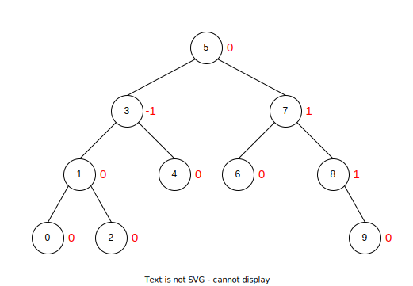
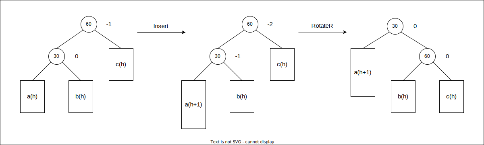
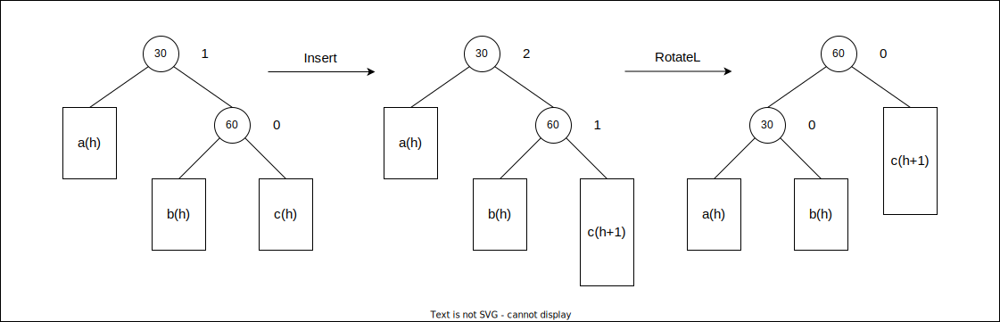
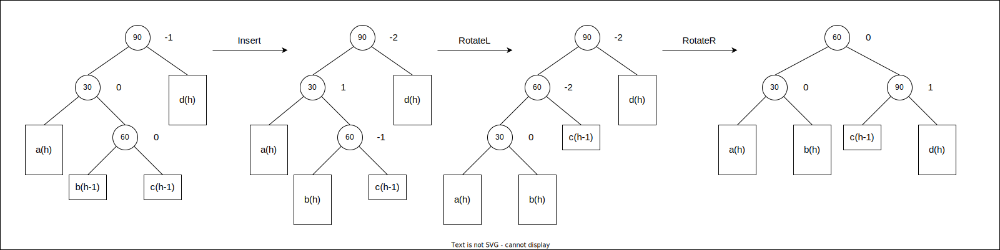
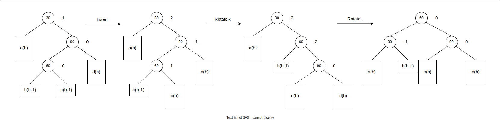

# Lesson14--map和set

## 1. 关联式容器

如 `vector` , `list` , `deque` , `forward_list` 等,这些容器统称为序列式容器,因为其底层为线性序列的数据结构,里面存储的是元素本身.

**关联式容器** 也是用来存储数据的,与序列式容器不同,其里面存储的是 `<key,value>` 结构的键值对,在数据检索时比序列式容器效率更高.

## 2. 键值对

用来表示具有一一对应关系的一种结构,该结构中一般只包含两个成员变量 `key` 和 `value` , `key` 代表键值, `value` 表示与 `key` 对应的信息.

SGI-STL中关于键值对的定义:

```C++{.line-numbers}
template <class T1,class T2>
struct pair
{
typedef T1 first_type;
typedef T2 second_type;

T1 first;
T2 second;
pair():first(T1()),second(T2())
{}
pair(const T1& a,const T2& b):first(a),second(b)
{}
};
```

## 3. 树形结构的关联式容器

根据应用场景的不同,STL总共实现了两种不同结构的关联式容器: **树形结构** 与 **哈希结构** .  
树形结构的关联式容器主要有四种: `map` , `set` , `multimap` , `multiset` .这四种容器的共同点是:使用平衡搜索树(即红黑树)作为其底层结果,容器中的元素是一个有序的序列.

### 3.1 set

#### 3.1.1 set的介绍

1. `set` 是按照一定次序存储元素的容器.
2. 在 `set` 中,元素的 `value` 也标识它( `value` 就是 `key` ,类型为 `T` ),并且每个 `value` 必须是唯一的. `set` 中的元素不能在容器中修改(元素总是 `const` ),但是可以从容器中插入或删除它们.
3. 在内部, `set` 中的元素总是按照其内部比较对象(类型比较)所指示的特定严格弱排序准则进行排序.
4. `set` 容器通过 `key` 访问单个元素的速度通常比` `unordered_set` 容器慢,但它们允许根据顺序对子集进行直接迭代.
5. `set` 在底层是用二叉搜索树(红黑树)实现的.

注意:
1. 与 `map/multimap` 不同, `map/multimap` 中存储的是真正的键值对 `<key, value>` , `set` 中只放 `value` ,但在底层实际存放的是由 `<value, value>` 构成的键值对.
2. `set` 中插入元素时,只需要插入 `value` 即可,不需要构造键值对.
3. `set` 中的元素不可以重复(因此可以使用 `set` 进行去重).
4. 使用 `set` 的迭代器遍历 `set` 中的元素,可以得到有序序列.
5. `set` 中的元素默认按照小于来比较.
6. `set` 中查找某个元素,时间复杂度为: $log_2 N$ .
7. `set` 中的元素不允许修改.
8. `set` 中的底层使用二叉搜索树(红黑树)来实现.

#### 3.1.2 set的使用

1. `set` 的模板参数列表
   ```C++{.line-numbers}
   template <class T,class Compare = less<T>,class Alloc = allocator<T>> 
   class set;
   ```
   `T` : `set` 中存放元素的类型,实际在底层存储 `<value,value>` 的键值对.  
   `Compare` : `set` 中元素默认按照小于来比较.
   `Alloc` : `set` 中元素空间的管理方式,使用STL提供的空间配置器管理.
2. `set` 的构造
   |                                                   函数声明                                                    |                 功能介绍                 |
   | :-----------------------------------------------------------------------------------------------------------: | :--------------------------------------: |
   |                       `set(const Compare&comp=Compare(),const Allocator&=Allocator());`                       |              构造空的 `set`              |
   | `set(InputIterator first,InputIterator last,const Compare& comp = Compare(),const Allocator& = Allocator());` | 用 `(first,last)` 区间中的元素构造 `set` |
   |                                  `set(const set<Key,Compare,Allocator>& x);`                                  |            `set` 的`拷贝构造             |
3. `set` 的构造
   |                函数声明                 |                         功能介绍                         |
   | :-------------------------------------: | :------------------------------------------------------: |
   |           `iterator begin()`            |            返回 `set` 中起始元素位置的迭代器             |
   |            `iterator end()`             |        返回 `set` 中最后一个元素后面位置的迭代器         |
   |     `const_iterator cbegin()const`      |        返回 `set` 中起始元素位置的 `const` 迭代器        |
   |      `const_iterator cend()const`       |    返回 `set` 中最后一个元素后面位置的 `const` 迭代器    |
   |       `reverse_iterator rbegin()`       |        返回 `set` 中最后一个元素位置的反向迭代器         |
   |        `reverse_iterator rend()`        |  返回 `set` 中最第一个元素的前一个元素位置的反向迭代器   |
   | `const_reverse_iterator crbegin()const` |    返回 `set` 中最后一个元素位置的反向 `const` 迭代器    |
   |  `cosnt_reverse_iterator crend()const`  | 返回 `set` 中第一个元素的前一个位置的反向 `const` 迭代器 |
4. `set`的容量
   |       函数声明       |                      功能介绍                       |
   | :------------------: | :-------------------------------------------------: |
   | `bool empty()const`  | 检测 `set` 是否为空,空返回 `true` ,否则返回 `false` |
   | `size_t size()const` |              返回 `set` 中有效元素个数              |
5. `set` 修改操作
   |                     函数声明                     |                                                                                      功能介绍                                                                                      |
   | :----------------------------------------------: | :--------------------------------------------------------------------------------------------------------------------------------------------------------------------------------: |
   | `pair<iterator,bool>insert(const value_type& x)` | 在 `set` 中插入元素 `x` ,实际插入的是 `<x,x>` 构成的键值对,如果插入成功,返回 `<该元素在set中的位置,true>` ,如果插入失败,说明 `x` 在 `set` 中已经存在,返回 `<x在set中的位置,false>` |
   |         `void erase(iterator position)`          |                                                                       删除 `set` 中 `position` 位置上的元素                                                                        |
   |       `size_type erase(const key_type& x)`       |                                                                  删除 `set` 中值为 `x` 的元素,返回删除元素的个数                                                                   |
   |    `void erase(iterator first,iterator last)`    |                                                                     删除 `set` 中 `[first,last)` 区间中的元素                                                                      |
   |   `void swap(set<Key,Compare,Allocator>& st)`    |                                                                                交换 `set` 中的元素                                                                                 |
   |                  `void clear()`                  |                                                                               将 `set` 中的元素清空                                                                                |
   |     `iterator find(const key_type& x)const`      |                                                                         返回 `set` 中值为 `x` 的元素的位置                                                                         |
   |    `size_type count(const key_type& x)const`     |                                                                         返回 `set` 中值为 `x` 的元素的个数                                                                         |

```C++{.line-numbers}
#include<set>
void TestSet()
{
   int array[]={1,3,5,7,9,2,4,6,8,0,1,3,5,7,9,2,4,6,8,0};
   std::set<int>s(array,array + sizeof(array) / sizeof(int));
   std::cout << s.size() << std::endl;

   for(auto&e:s)
   {
      std::cout << e << " ";
   }
   std::cout << std::endl;

   for(auto it = s.rbegin();it != s.rend();++it)
   {
      std::cout << *it << " ";
   }
   std::cout << std::endl;

   std::cout << s.count(3) << std::endl;
}
```

### 3.2 map

#### 3.2.1 map的介绍

1. `map` 是关联容器,它按照特定的次序(按照 `key` 来比较)存储由键值 `key` 和值 `value` 组合而成的元素.
2. 在 `map` 中,键值 `key` 通常用于排序和唯一地标识元素,而值 `value` 中存储与此键值 `key` 关联的内容.键值 `key` 和值 `value` 的类型可能不同,并且在 `map` 的内部, `key` 与 `value` 通过成员类型 `value_type` 绑定在一起,为其取别名称为 `pair` : `typedef pair<const key, T> value_type;` .
3. 在内部, `map` 中的元素总是按照键值 `key` 进行比较排序的.
4. `map` 中通过键值访问单个元素的速度通常比 `unordered_map` 容器慢,但 `map` 允许根据顺序对元素进行直接迭代(即对 `map` 中的元素进行迭代时,可以得到一个有序的序列).
5. `map` 支持下标访问符,即在 `[]` 中放入 `key` ,就可以找到与 `key` 对应的 `value` .
6. `map` 通常被实现为平衡二叉搜索树(红黑树).

#### 3.2.2 map的使用

1. `map` 的模板参数说明
   ```C++{.line-numbers}
   template<class Key,class T,class Compare = less<Key>,class Alloc = allocator<pair<const Key,T>>>
   class map;
   ```
   `Key` : 键值对中 `Key` 的类型.
   `T` : 键值对中 `value` 的类型.
   `Compare` : 比较器的类型, `map` 中的元素是按照 `Key` 来比较的,缺省情况下按照小于来比较.
   `Alloc` : 通过空间配置器来申请底层空间,不需要用户传递,除非用户不想使用标准库提供的空间配置器.
2. `map` 的构造
   | 函数声明 |      功能介绍      |
   | :------: | :----------------: |
   | `map()`  | 构造一个空的 `map` |
3. `map` 的迭代器
   |         函数声明         |                                功能介绍                                 |
   | :----------------------: | :---------------------------------------------------------------------: |
   |   `begin()` 和 `end()`   |       `begin` 返回首元素的位置, `end` 返回最后一个元素下一个位置        |
   |  `cbegin()` 和 `cend()`  | 与 `begin` 和 `end` 意义相同,但 `cbegin` 和 `cend` 所指向的元素不能修改 |
   |  `rbegin()` 和 `rend()`  |                               反向迭代器                                |
   | `crbegin()` 和 `crend()` |                        `const` 修饰的反向迭代器                         |
4. `map` 的容量与元素访问
   |                   函数声明                   |                          功能简介                           |
   | :------------------------------------------: | :---------------------------------------------------------: |
   |             `bool empty()const`              | 检测 `map` 中的元素是否为空,是返回 `true` ,否则返回 `false` |
   |           `size_type size()const`            |                 返回 `map` 中有效元素的个数                 |
   | `mapped_type& operator[](const key_type& k)` |                  返回 `key` 对应的 `value`                  |
   > 在元素访问时,有一个与 `operator[]` 类似的函数 `at()` ,都是通过 `key` 找到 `key` 对应的 `value` 然后返回其引用.不同的是,当 `key` 不存在时, `operator[]` 用默认 `value` 与 `key` 构造键值对然后插入,返回默认 `value` , `at()` 函数直接抛异常.
5. `map` 中元素的修改
   |                     函数声明                      |                                                                        功能简介                                                                         |
   | :-----------------------------------------------: | :-----------------------------------------------------------------------------------------------------------------------------------------------------: |
   | `pair<iterator,bool> insert(const value_type& x)` |               在 `map` 中插入键值对 `x` ,注意 `x` 是一个键值对,返回值也是键值对: `iterator`代表新插入元素的位置, `bool` 代表释放插入成功                |
   |          `void erase(iterator position)`          |                                                              删除 `position` 位置上的元素                                                               |
   |       `size_type erase(const key_type& x)`        |                                                                  删除键值为 `x` 的元素                                                                  |
   |    `void erase(iterator first,iterator last)`     |                                                            删除 `[first,last)` 区间中的元素                                                             |
   |   `void swap(map<Key,T,Compare,Allocator>& mp)`   |                                                                 交换两个 `map` 中的元素                                                                 |
   |                  `void clear()`                   |                                                                  将 `map` 中的元素清空                                                                  |
   |        `iterator find(const key_type& x)`         |                                      在 `map` 中插入 `key` 为 `x` 的元素,找到返回该元素位置的迭代器,否则返回 `end`                                      |
   |   `const_iterator find(const key_type& x)const`   |                                 在 `map` 中插入 `key` 为 `x` 的元素,找到返回该元素位置的 `const` 迭代器,否则返回 `cend`                                 |
   |      size_type count(const key_type& x)const      | 返回 `key` 为 `x` 的键值在 `map` 中的个数,注意 `map` 中 `key` 是唯一的,因此该函数的返回值要么为0,要么为1,因此可以用该函数检测一个 `key` 是否在 `map` 中 |

**总结** :
1. `map` 中的元素是键值对.
2. `map` 中的 `key` 是唯一的,并且不能修改.
3. 默认按照小于方式对 `key` 进行比较.
4. `map` 中的元素如果用迭代器去遍历,就可以得到一个有序序列.
5. `map` 的底层为平衡搜索树(红黑树),查找效率比较高 $\Omicron \log_2N$ .
6. 支持 `[]` 操作符`, `operator[]` 中实际进行插入查找.

```C++{.line-numbers}
#include<string>
#include<map>
using namespace std;
void TestMap()
{
   map<string,string> m;
   pair<string,string> kv1("cloud","云母");
   m.insert(kv1);//将键值对kv1插入map中
   m.insert(pair<string,string>("Luna","月亮"));//匿名对象
   m.insert(make_pair("Sun","太阳"));//用make_pair函数构造键值对
   m.insert({"Star","星星"});//{}表示隐式类型转换,单参构造函数支持隐式类型转换
   pair<string,string> kv2={"earth","地球"};
   m["sky"]="天空";
   auto it = m.begin()
   while(it != m.end())
   {
      cout << (*it).first << ":" << (*it).second << endl;
      cout << it->first << ":" << it->second << endl;
      cout << it.operator->()->first << ":" << it.operator->()->second << endl;
      ++it;
   }
   cout << endl;
   for(auto& kv : m)
   {
      auto&[x,y] = kv;//C++17
      cout << x << ":" << y << endl;
   }
}
```

### 3.3 multiset

#### 3.3.1 multiset的介绍

1. `multiset` 是按照特定顺序存储元素的容器,其中元素是可以重复的.
2. 在 `multiset` 中,元素的 `value` 也会识别它(因为 `multiset` 中本身存储的就是 `<value,value>` 组成的键值对,因此 `value` 本身就是 `key` ). `multiset` 元素的值不能在容器中修改,但可以从容器中插入或删除.
3. 在内部, `multiset` 中的元素总是按照其内部比较规则所指示的特定严格弱排序准则进行排序.
4. `multiset` 容器通过 `key` 访问单个元素的速度通常比 `unordered_multiset` 容器慢,但当使用迭代器遍历时会得到一个有序序列.
5. `multiset` 底层结构为二叉搜索树(红黑树).

注意:
1. `multiset` 中在底层存储的是 `<value,value>` 的键值对.
2. `multiset` 的插入接口中只需要插入即可.
3. 与 `set` 的区别是, `multiset` 中的元素可以重复, `set` 中 `value` 是唯一的.
4. 使用迭代器对 `multiset` 中的元素进行遍历,可以得到有序的序列.
5. `multiset` 中的元素不能修改.
6. 在 `multiset` 中找某个元素,时间复杂度为 $\Omicron(\log_2N)$ .
7. `multiset` 的作用:可以对元素进行排序.

#### 3.3.2 multiset的使用

```C++{.line-numbers}
#include <set>
void TestMultiset()
{
   int array[] = {2,1,3,9,6,0,5,8,4,7};
   //multiset在底层实际存储的是<int,int>键值对
   multiset<int> s(array,array+sizeof(array)/sizeof(array[0]));
   for(auto& e : s)
      cout << e << " ";
   cout << endl;
   return 0;
}
```

### 3.4 multimap

#### 3.4.1 multimap的介绍

1. `multimap` 是关联式容器,它按照特定的顺序,存储由 `key` 和 `value` 映射成的键值对 `<key,value>` ,其中多个键值对之间的 `key` 是可以重复的.
2. 在 `multimap` 中,通常按照 `key` 排序和唯一地标识元素,而映射的 `value` 存储与 `key` 关联的内容. `key` 和 `value` 的类型可能不同,通过 `multimap` 内部的成员类型 `value_type` 组合在一起, `value_type` 是组合 `key` 和 `value` 的键值对: `typedef pair<const Key,T> value_type;` .
3. 在内部, `multimap` 中的元素总是通过其内部比较对象,按照指定的特定严格弱排序标准对 `key` 进行排序的.
4. `multimap` 通过 `key` 访问单个元素的速度通常比 `unordered_multimap` 容器慢,但是使用迭代器直接遍历 `multimap` 中的元素可以等到关于 `key` 有序的序列.
5. `multimap` 在底层用二叉搜索树(红黑树)来实现.

**注意: `multimap` 和 `map` 的唯一不同就是 `map` 中的 `key` 是唯一的,而 `multimap` 中的 `key` 是可以重复的.

#### 3.4.2 multimap的使用

1. `multimap` 接口与 `map` 类似.
2. `multimap` 中的元素默认将 `key` 按照小于比较.
3. `multimap` 中没有重载 `operator[]` .
4. 头文件与 `map` 相同.

## 4. 底层结构

`map/multimap/set/multiset` 这几个容器的共同点是: **其底层都是按照二叉搜索树来实现的** .二叉搜索树有其自身的缺陷,假如向树中插入的元素有序或接近有序,二叉树就会退化成单支树,时间复杂度会退化成 $\Omicron (N)$ ,因此, `map/set` 等关联式容器的底层结构对二叉树进行了平衡处理,即采用平衡树来实现.

### 4.1 AVL树

#### 4.1.1 AVL树的概念

两位俄罗斯的数学家 *G.M.Adelson-Velskii* 和 *E.M.Landis* 在1962年发明了一种方法:当向二叉搜索树中插入新节点后,如果能保证 **每个节点的左右子树高度之差的绝对值不超过1** (需要对树中的节点进行调整),即可降低树的高度,从而减少平均搜索长度.



#### 4.1.2 AVL树节点的定义

```C++{.line-numbers}
template <class K, class V>
struct pair
{
    K first;
    V second;
    pair()
};
template <class K, class V>
struct AVLTreeNode
{
    AVLTreeNode<K, V> *_left;
    AVLTreeNode<K, V> *_right;
    AVLTreeNode<K, V> *_parent;
    pair<K, V> _kv;
    int _bf; // balance factor
    AVLTreeNode(const pair<K, V> &kv)
        : _left(nullptr), _right(nullptr), _parent(nullptr), _kv(kv), _bf(0)
    {
    }
};
```

#### 4.1.3 AVL树的插入

AVL树就是在二叉搜索树的基础上引入了平衡因子,因此AVL树也可以看成是二叉搜索树.  
1. 按照二叉搜索树的方式插入新节点.
2. 调整节点的平衡因子.

#### 4.1.4 AVL树的旋转

如果在一棵原本是平衡的AVL树中插入一个新节点,可能造成不平衡,此时必须调整树的结构,使之平衡化.根据节点插入位置不同,AVL树的旋转分为四种:
1. 新节点插入较高左子树的左侧--左左:右单旋
   
2. 新节点插入较高右子树的右侧--右右:左单旋
   
3. 新节点插入较高左子树的右侧--左右:先左单旋再右单旋
   
4. 新节点插入较高右子树的左侧--右左:先右单旋再左单旋
   

#### 4.1.5 AVL树的验证

1. 验证其为二叉搜索树
2. 验证其为平衡树

#### 4.1.6 AVL树的删除

因为AVL树也是二叉搜索树,可以按照二叉搜索树的方式将节点删除,然后再更新平衡因子,删除节点后的平衡因子更新最差情况下要一直更新到根节点的位置.

#### 4.1.7 AVL树的性能

AVL树是一棵绝对平衡的二叉搜索树,其要求每个节点的左右子树高度差的绝对值都不超过1,这样可以保证查询时高效的时间复杂度,即 $\log_2(N)$ .但是如果要对AVL树做一些结构修改的操作,性能非常低下,比如:插入时要维护其绝对平衡,旋转次数比较多,更差的是在删除时,有可能一直要让旋转持续到根的位置.因此,如果需要一种查询高效且有序的数据结构,而且数据的个数为静态的,可以考虑AVL树.

### 4.2 红黑树

#### 4.2.1 红黑树的概念

红黑树是一种二叉搜索树,但在每个节点上增加一个存储位表示节点的颜色,可以是Red或Black.通过对任何一条从根节点到叶子的路径上各个节点着色方式的限制,红黑树确保没有一条路径会比其它路径长出两倍,因而是接近平衡的.

#### 4.2.2 红黑树的性质

1. 每个节点不是红色就是黑色.
2. 根节点是黑色的.
3. 如果一个节点是红色的,则它的两个孩子节点是黑色的.
4. 对于每个节点,从该节点到其所有后代叶节点的简单路径上,均包含相同数目的黑色节点.
5. 每个叶子节点都是黑色的(指空节点).